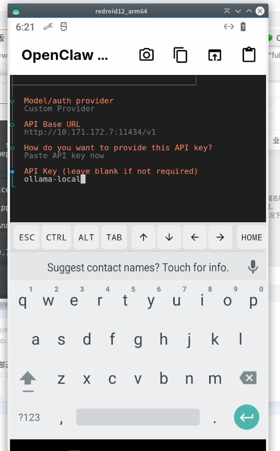
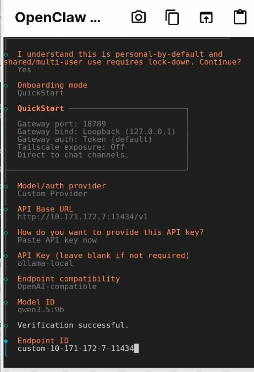
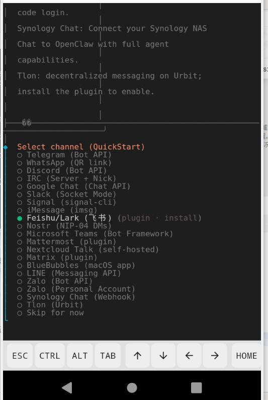
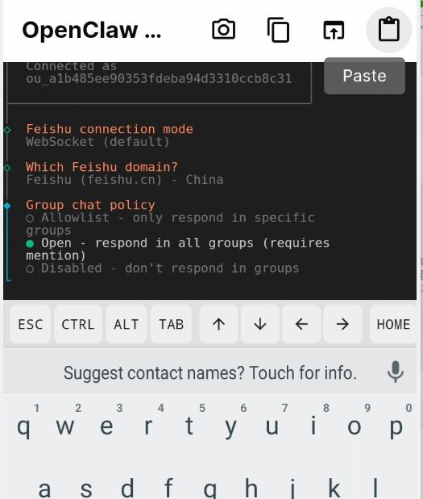
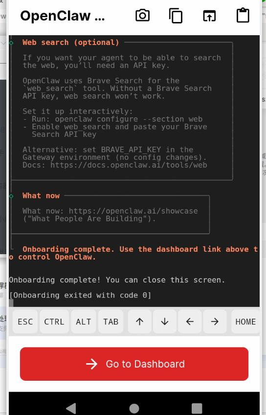
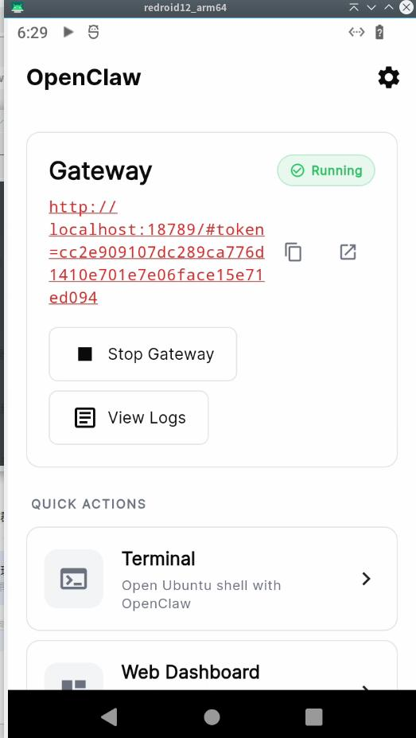

# 20260305
### 1. ollama for android
api key for ollama:    

Configure for feishu:     

Download from npm:     

Select Open:     

skip memory, install some bootcmds.   

manually start the Gateway:     

Now Add 长连接   

飞书客户端点开应用:      

