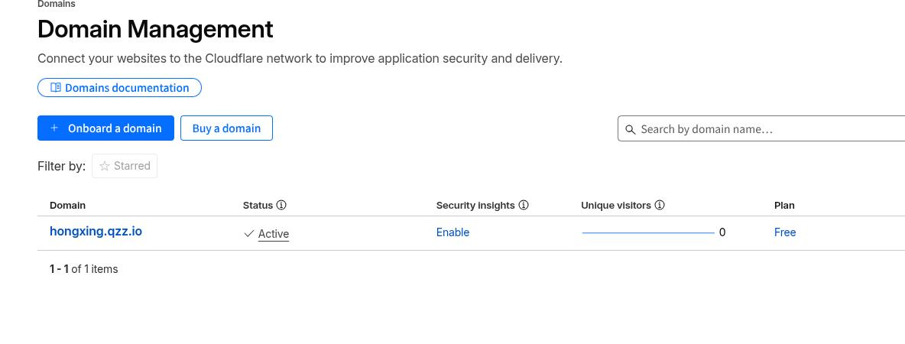

# 20260306
### 1. openclaw config
tool's profile should be full:    

```
openclaw config get tools
如果返回：
{ "profile": "messaging" }
```

profiles:     

```
messaging —— 只能发消息、管理会话
default —— 默认工具集
coding —— 编程相关工具
full —— 完整工具集，包含命令执行
all —— 所有工具全开
```
Switch to full:    

```
openclaw config set tools.profile full
systemctl restart openclaw-gateway
```
### 2. hongxin domain name
domain name:    

```
hongxing.qzz.io
```



注意，该域名只有180天可用，如果需要继续使用则需要操作如下


