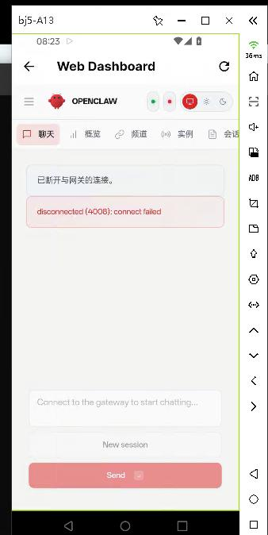

# 20260312
### 1. cuttlefish(Ubuntu2404)

```
sudo apt update -y
sudo apt upgrade -y
sudo curl -fsSL https://us-apt.pkg.dev/doc/repo-signing-key.gpg | sudo apt-key add -
$ cat /etc/apt/sources.list
# Ubuntu sources have moved to /etc/apt/sources.list.d/ubuntu.sources
deb https://us-apt.pkg.dev/projects/android-cuttlefish-artifacts android-cuttlefish main
sudo apt update -y
sudo apt install cuttlefish-base cuttlefish-user cuttlefish-orchestration
sudo usermod -aG kvm,cvdnetwork,render $USER
sudo reboot
```
After reboot:      

```
test@cuttlefish:~/cf$ ls
android-info.txt  bootloader           cuttlefish_runtime    init_boot.img                        metadata.img  super.img     vbmeta.img
bin               cuttlefish           cuttlefish_runtime.1  launcher_pseudo_fetcher_config.json  misc.img      userdata.img  vbmeta_system.img
boot.img          cuttlefish_assembly  etc                   lib64                                nativetest64  usr           vendor_boot.img
$ HOME=$PWD ./bin/launch_cvd   --daemon   --start_webrtc=true     --num_instances=1 --cpus=8 --memory_mb=8192
```
Start the 2nd instance:       

```
# 第二个实例（从 instance 2 开始）
HOME=$PWD ./bin/launch_cvd \
  --daemon \
  --start_webrtc=true \
  --num_instances=1 \
  --base_instance_num=2 \
  --cpus=8 \
  --memory_mb=8192
```

### 2. tyy issue
disconnected(4008): connect failed.    



In cuttlefish, is the same.     

```
ssh into the proot environment, then :    

root@localhost:~# !2
ss -ltnp | grep -i 18789
Cannot open netlink socket: Permission denied
```

### 3. ss installation
Install via:     

```
$ apt install iproute2
```

