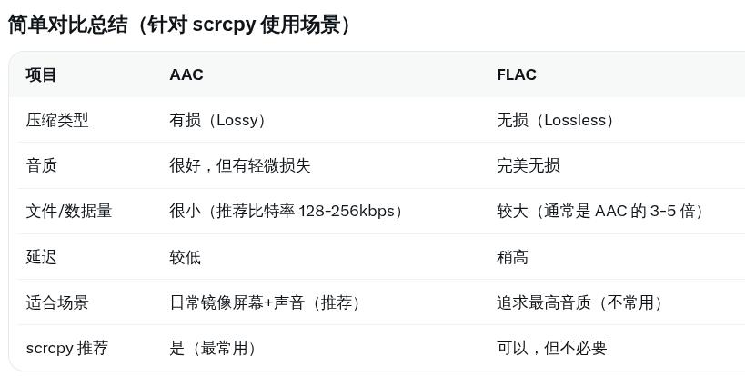

# 20260325
### 1. scrcpy issue
List all of the available codecs:      

```
scrcpy --list-encoders
(audio)aac/flac/(video)h264
```
Then connect via:      

```
scrcpy --audio-codec=aac
```



### 2. virt wifi
modprobe some modules:      

```
sudo modprobe mac80211_hwsim
sudo modprobe iptable_nat
```
### 3. detection
via:     

```
D NetworkMonitor/100: PROBE_HTTP http://connectivitycheck.gstatic.com/generate_204 tim
D NetworkMonitor/100: PROBE_HTTPS https://www.google.com/generate_204 tim
...

i think the solution is adb shell settings put global captive_portal_https_url https://www.noisyfox.cn/generate_204
and the https://www.noisyfox.cn/generate_204 can be replaced by any 204 servies
```

