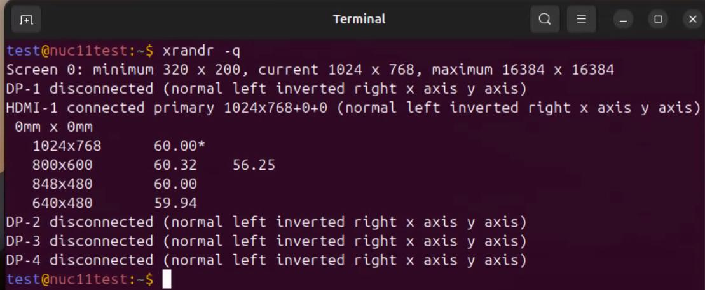
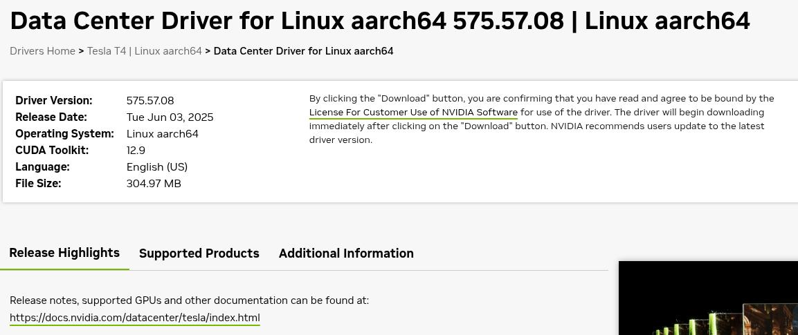

# 20260509
### 1. fake edid
via:      

```
test@nuc11test:~$ for p in /sys/class/drm/*/status; do echo -n "${p%/status}: "; cat $p; done
/sys/class/drm/card0-DP-1: disconnected
/sys/class/drm/card0-DP-2: disconnected
/sys/class/drm/card0-DP-3: disconnected
/sys/class/drm/card0-DP-4: disconnected
/sys/class/drm/card0-HDMI-A-1: connected
test@nuc11test:~$ cat /proc/cmdline
BOOT_IMAGE=/boot/vmlinuz-6.8.0-107-generic root=UUID=b3864545-72d3-4d4c-95a8-5b7a5bb2e4ae ro net.ifnames=0 biosdevname=0 video=HDMI-A-1:1920x1080@60e
```
But the nxserver will only display 1024x768@60.00    



### 2. nvidia(aarch64)
Install nvidia-container-toolkit:     

```
curl -s -L https://nvidia.github.io/libnvidia-container/stable/rpm/nvidia-container-toolkit.repo |   sudo tee /etc/yum.repos.d/nvidia-container-toolkit.repo
  sudo dnf config-manager --enable nvidia-container-toolkit-experimental
  export NVIDIA_CONTAINER_TOOLKIT_VERSION=1.19.0-1
    sudo dnf install -y       nvidia-container-toolkit-${NVIDIA_CONTAINER_TOOLKIT_VERSION}       nvidia-container-toolkit-base-${NVIDIA_CONTAINER_TOOLKIT_VERSION}       libnvidia-container-tools-${NVIDIA_CONTAINER_TOOLKIT_VERSION}       libnvidia-container1-${NVIDIA_CONTAINER_TOOLKIT_VERSION}
```
Install nvidia t4 driver:     

```
sudo ./NVIDIA-Linux-aarch64-575.57.08.run 
   sudo reboot
```
Examine the output:      

```
[test@redroid ~]$ sudo nvidia-smi
Sat May  9 11:51:00 2026       
+-----------------------------------------------------------------------------------------+
| NVIDIA-SMI 575.57.08              Driver Version: 575.57.08      CUDA Version: 12.9     |
|-----------------------------------------+------------------------+----------------------+
| GPU  Name                 Persistence-M | Bus-Id          Disp.A | Volatile Uncorr. ECC |
| Fan  Temp   Perf          Pwr:Usage/Cap |           Memory-Usage | GPU-Util  Compute M. |
|                                         |                        |               MIG M. |
|=========================================+========================+======================|
|   0  Tesla T4                       Off |   00000000:08:00.0 Off |                    0 |
| N/A   52C    P0             28W /   70W |       0MiB /  15360MiB |      0%      Default |
|                                         |                        |                  N/A |
+-----------------------------------------+------------------------+----------------------+
                                                                                         
+-----------------------------------------------------------------------------------------+
| Processes:                                                                              |
|  GPU   GI   CI              PID   Type   Process name                        GPU Memory |
|        ID   ID                                                               Usage      |
|=========================================================================================|
|  No running processes found                                                             |
+-----------------------------------------------------------------------------------------+
```
Now you should upgrade the docker:     

```
[test@redroid ~]$ sudo docker version
Client:
 Version:           18.09.0
 EulerVersion:      18.09.0.345
 API version:       1.39
 Go version:        go1.17.3
 Git commit:        d51e3ad
 Built:             Wed Dec 11 08:46:16 2024
 OS/Arch:           linux/arm64
 Experimental:      false

Server:
 Engine:
  Version:          18.09.0
  EulerVersion:     18.09.0.345
  API version:      1.39 (minimum version 1.12)
  Go version:       go1.17.3
  Git commit:       d51e3ad
  Built:            Wed Dec 11 08:45:31 2024
  OS/Arch:          linux/arm64
  Experimental:     false
[test@redroid ~]$ sudo docker info | grep -iE 'runtime|gpu|nvidia'
Runtimes: runc
Default Runtime: runc
```
Change docker via:      

```
wget https://mirrors.nju.edu.cn/docker-ce/linux/static/stable/aarch64/docker-27.5.1.tgz
sudo yum remove docker-engine
sudo reboot
tar -xzf docker-*.tgz
sudo cp docker/* /usr/bin/
sudo chmod +x /usr/bin/docker*
sudo tee /etc/systemd/system/docker.service > /dev/null <<EOF
    [Unit]
    Description=Docker Application Container Engine
    Documentation=https://docs.docker.com
    After=network-online.target firewalld.service
    Wants=network-online.target
    
    [Service]
    Type=notify
    ExecStart=/usr/bin/dockerd
    ExecReload=/bin/kill -s HUP \$MAINPID
    TimeoutStartSec=0
    RestartSec=2
    Restart=always
    StartLimitBurst=3
    StartLimitInterval=60s
    LimitNOFILE=infinity
    LimitNPROC=infinity
    LimitCORE=infinity
    TasksMax=infinity
    Delegate=yes
    KillMode=process
    
    [Install]
    WantedBy=multi-user.target
    EOF
sudo systemctl daemon-reload
sudo systemctl enable --now docker
sudo systemctl status docker
sudo docker info | grep -iE 'runtime|gpu|nvidia'
sudo vim /etc/docker/daemon.json 
           #### Add
           "runtimes": {
           "nvidia": {
               "args": [],
               "path": "nvidia-container-runtime"
           }
       }

sudo systemctl daemon-reload
sudo systemctl restart docker
sudo docker info | grep -iE 'runtime|gpu|nvidia'
```
Then run :     

```
sudo docker run -d --gpus=all   -v /home/test/ollama:/root/.ollama   -p 11434:11434   --name ollama   --restart always   ollama/ollama
sudo docker exec -it ollama ollama list
sudo docker exec -it ollama ollama run gemma4:e2b
```
Nvidia tesla t4 driver download page:   



### 3. custom model for compression:
Edit `~/.hermes/config.yaml` to:    

```
  compression:
    provider: custom
    model: gemma4:e2b
    base_url: http://192.168.1.165:11434/v1
    api_key: ''
    timeout: 180
    extra_body: {}
```
