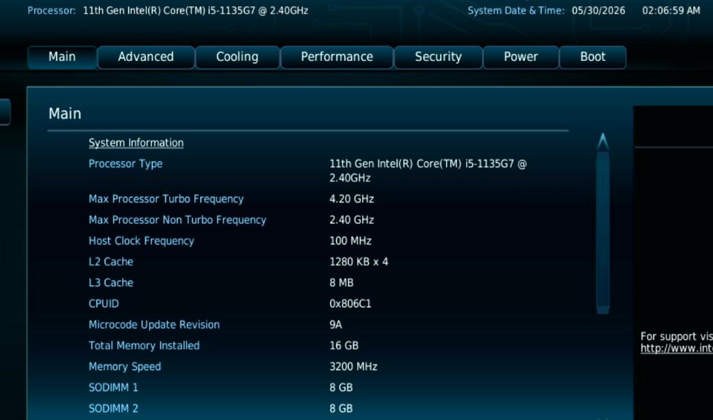
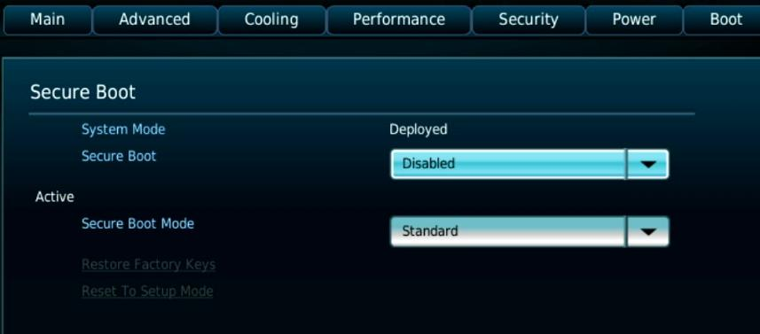
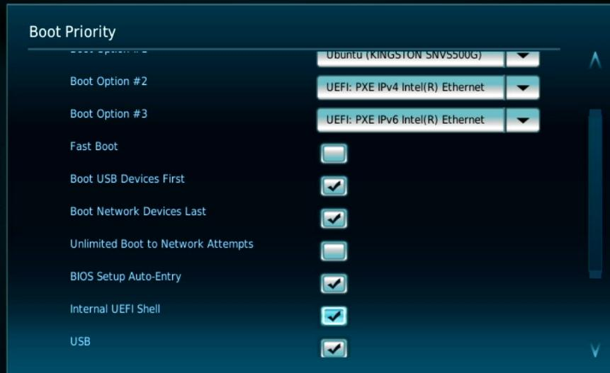
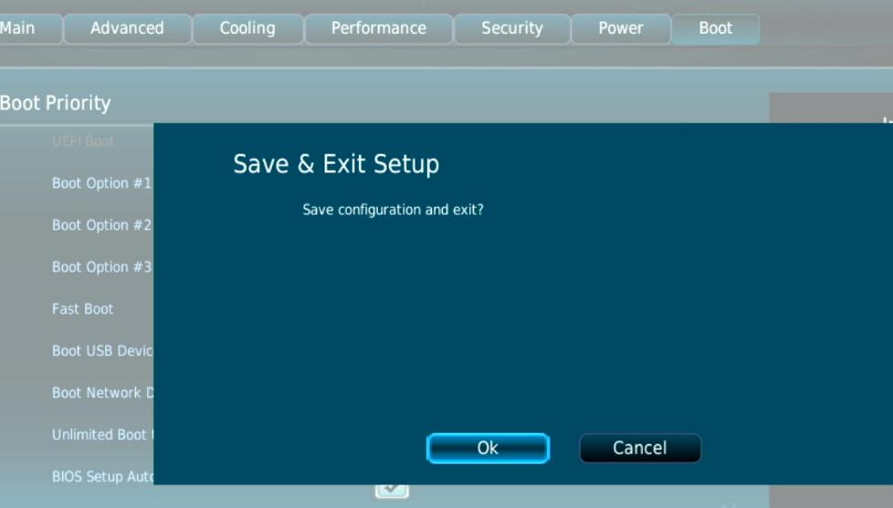
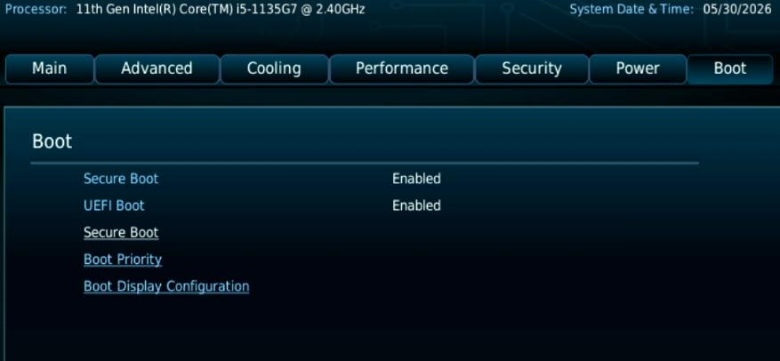
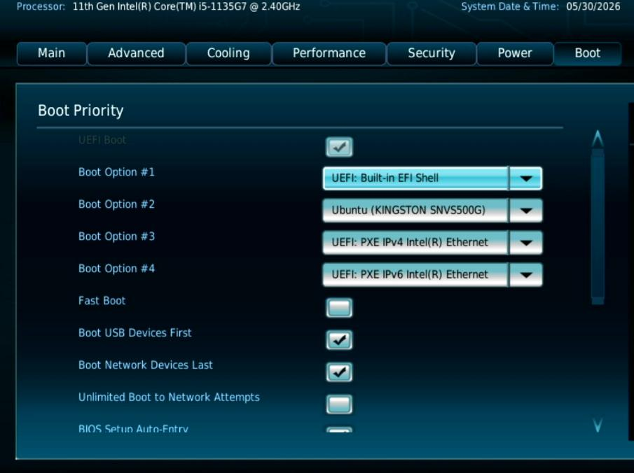
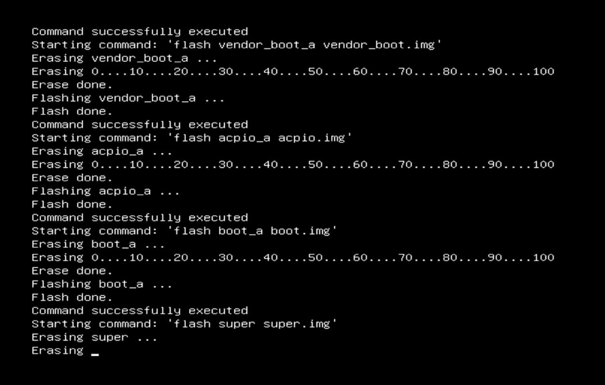
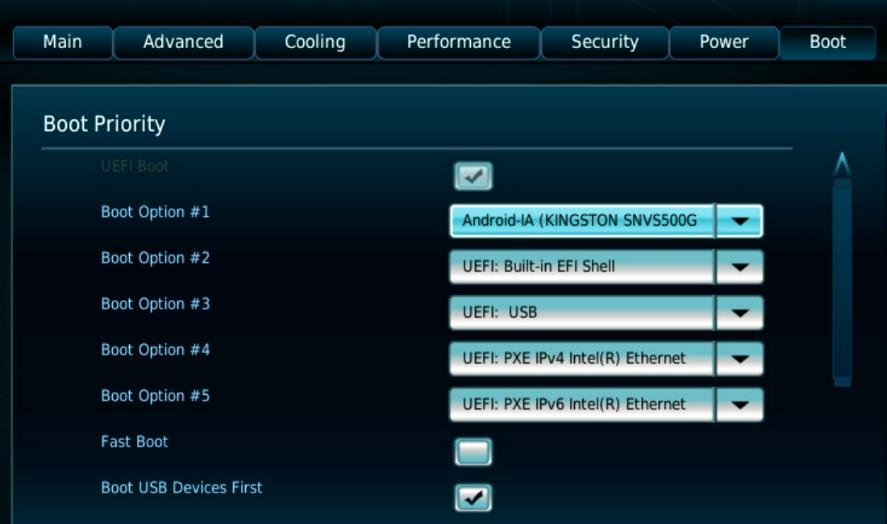

# 20260530
### 1. CIV in bare metal

Nuc11:    



Disable Secure Boot:    



Check `Internal UEFI Shell` in `Boot Priority`:     



Save & Exit Setup:    




Boot->Boot Priority:   



Set the boot priority:    




Save and reboot the machine.    
Auto Flash:    



After Flash:    




```
1|caas:/ # dumpsys SurfaceFlinger  | grep GLES
GLES: Intel, Mesa Intel(R) Xe Graphics (TGL GT2), OpenGL ES 3.2 Mesa 21.1.5 (git-4096b2ff69)
test@nuc11test:~/scrcpy-linux-x86_64-v4.0$ ./scrcpy --list-encoders
scrcpy 4.0 <https://github.com/Genymobile/scrcpy>
INFO: ADB device found:
INFO:     --> (tcpip)  10.171.172.240:5555             device  AOSP_on_Intel_Platform
/home/test/scrcpy-linux-x86_64-v4.0/scrcpy-server: 1 file pushed, 0 skipped. 662.5 MB/s (732226 bytes in 0.001s)
[server] INFO: Device: [Intel] intel AOSP on Intel Platform (Android 11)
[server] INFO: List of video encoders:
    --video-codec=h264 --video-encoder=OMX.Intel.hw_ve.h264           (hw) [vendor]
    --video-codec=h264 --video-encoder=c2.android.avc.encoder         (sw)
    --video-codec=h264 --video-encoder=OMX.google.h264.encoder        (sw) (alias for c2.android.avc.encoder)
    --video-codec=h265 --video-encoder=OMX.Intel.hw_ve.h265           (hw) [vendor]
    --video-codec=h265 --video-encoder=c2.android.hevc.encoder        (sw)
[server] INFO: List of audio encoders:
    --audio-codec=opus --audio-encoder=c2.android.opus.encoder        (sw)
    --audio-codec=aac --audio-encoder=c2.android.aac.encoder          (sw)
    --audio-codec=aac --audio-encoder=OMX.google.aac.encoder          (sw) (alias for c2.android.aac.encoder)
    --audio-codec=flac --audio-encoder=c2.android.flac.encoder        (sw)
    --audio-codec=flac --audio-encoder=OMX.google.flac.encoder        (sw) (alias for c2.android.flac.encoder)
```

### 2. lxgw on ubuntu22.04
Quickly download and use lxgw on ubuntu2204:    

```
wget https://codeload.github.com/lxgw/LxgwWenKai/zip/refs/heads/main
unzip LxgwWenKai-main.zip
cd LxgwWenKai-main/
cd fonts/TTF/
sudo mkdir -p /usr/local/share/fonts/lxgw-wenkai
sudo cp * /usr/local/share/fonts/lxgw-wenkai/
sudo fc-cache -fv
fc-list | grep -i "lxgw"
```
