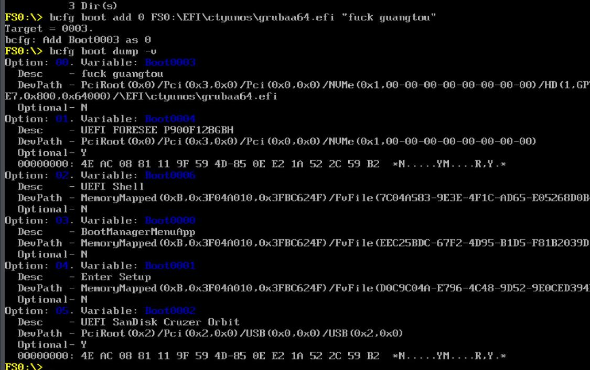

# 20260612
### 1. Manually Set efi items
The result



Answer from AI:     

```
步骤 1: 探索文件系统，找到新 GRUB在 UEFI Shell 提示符下（Shell>）：列出所有设备映射（很重要）：

map -r

或简单 map，记下 ESP（EFI System Partition，通常是 FAT32 分区）对应的 FS 编号，比如 FS0:、FS1: 等。通常新系统的 ESP 是最大的 FAT32 分区。
切换到 ESP 并查看 GRUB 文件：

fs0:          （替换为你 ESP 的编号）
ls
ls EFI\
ls EFI\grub     （或 EFI\ubuntu、EFI\arch、EFI\debian 等，根据你的新系统）

找到 grubx64.efi 文件，通常路径类似：FS0:\EFI\grub\grubx64.efi
FS0:\EFI\ubuntu\grubx64.efi
FS0:\EFI\BOOT\BOOTX64.EFI（fallback）

用 cd 命令浏览目录。

步骤 2: 添加新的 Boot Entry使用 bcfg 命令添加条目（编号从 0 开始，建议加到最前面）：

bcfg boot add 0 FS0:\EFI\grub\grubx64.efi "New GRUB"     （替换路径和名称）

0：插入到 BootOrder 的第 1 位（0 是最高优先级）。
路径必须正确（用你刚才找到的）。
最后一个是显示名称，可以自定义，如 "Ubuntu GRUB" 或 "Arch Linux"。

示例（常见 Ubuntu）：

bcfg boot add 0 FS0:\EFI\ubuntu\grubx64.efi "Ubuntu"

步骤 3: 检查和调整 Boot Order

bcfg boot dump -v     （详细列表当前所有 Boot 条目）
bcfg boot dump -b     （分页显示）

查看新添加的条目（通常是 Boot000X）。
如果需要调整顺序或删除旧条目：

bcfg boot mv 0 1      （移动条目）
bcfg boot rm X        （删除编号为 X 的条目，小心使用）

步骤 4: 退出并重启测试

exit

或直接重启机器（有些 Shell 有 reset 命令）。进入 BIOS/UEFI 设置（通常 Del / F2 / F10），在 Boot 选项中确认新 GRUB 条目出现在最前面，并设为第一优先级。

```

### 2. kea dhcp server timtout
via:      

```
valid-lifetime = 31536000; # 1年 (365天 × 24小时 × 60分钟 × 60秒)
      renew-timer = 0;           # 设为0让Kea自动计算 (约为15768000秒)
      rebind-timer = 0;          # 设为0让Kea自动计算 (约为27594000秒)
```
origin :      

```
rebind-timer = 2000;
renew-timer = 1000;
valid-lifetime = 2592000;

 valid-lifetime（有效生命周期 / 租约期限）
含义：分配给客户端的 IP 地址的总有效时长。

详解：在没有续约的情况下，客户端可以使用这个 IP 地址的最长时间。一旦过了这个时间，如果客户端没有成功续约，该 IP 地址将被服务器回收，客户端必须停止使用它。

数值解析：您原本设置的 2592000 秒，换算下来正好是 30 天（2592000 ÷ 3600 ÷ 24）。

2. renew-timer（续约定时器 / T1）
含义：客户端尝试单播（Unicast）向原分配该 IP 的 DHCP 服务器请求延长租约的时间点。

详解：当 IP 地址的使用时间达到 renew-timer 指定的秒数时，客户端会自动进入 Renewing 状态，直接向最初发放租约的 DHCP 服务器发送续约请求。

数值解析：您原本设置的是 1000 秒。

3. rebind-timer（重新绑定定时器 / T2）
含义：客户端尝试广播（Broadcast）向网络中任何可用的 DHCP 服务器请求延长租约的时间点。

详解：当 renew-timer 到期后，如果原 DHCP 服务器宕机或因网络原因未响应续约请求，客户端会继续使用 IP。等到时间来到 rebind-timer 指定的秒数时，客户端会进入 Rebounding 状态，向整个子网广播续约请求，希望其他 DHCP 服务器能接管或认可这个租约。

数值解析：您原本设置的是 2000 秒。
```

### 3. re-new

```
[0.008s] dash@home4500:/media/sda/testmesaredroid13$ rm -rf ./*
[32.748s] dash@home4500:/media/sda/testmesaredroid13$ ls
[0.008s] dash@home4500:/media/sda/testmesaredroid13$ ls .repo/
TRACE_FILE  copy-link-files.json  local_manifests  manifest.xml  manifests  manifests.git  project-objects  project.list  projects  repo
[0.008s] dash@home4500:/media/sda/testmesaredroid13$ sudo du -hs .repo/
28G     .repo/

```
