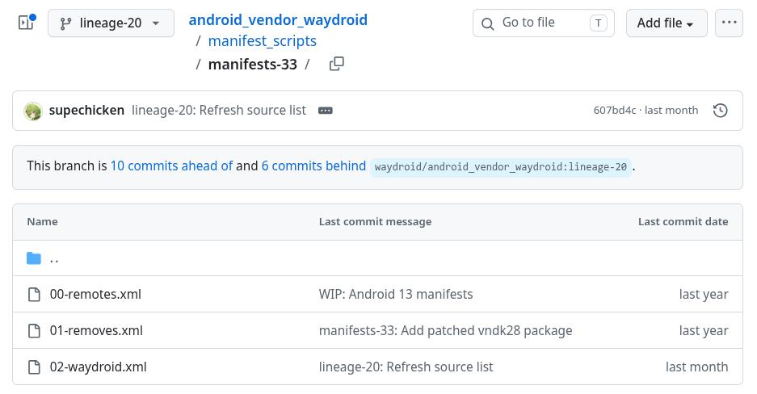
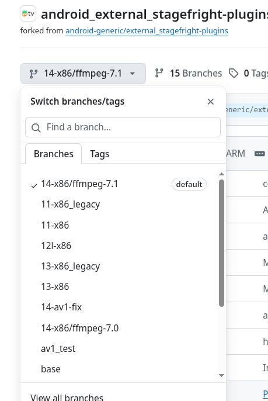

# 20260615
### 1. waydroid-atv building
从`https://github.com/WayDroid-ATV/waydroid-androidtv-builds/blob/main/BUILDING.md`(编译指南)获知：       

```
Setup LOS source (for ATV 13)
repo init -u https://github.com/LineageOS/android.git -b lineage-20.0 --git-lfs
repo sync build/make

wget -O - https://raw.githubusercontent.com/WayDroid-ATV/android_vendor_waydroid/lineage-20/manifest_scripts/generate-manifest.sh | bash
```
从`https://github.com/WayDroid-ATV/android_vendor_waydroid/blob/lineage-20/manifest_scripts/generate-manifest.sh`获知：       

```
sdkv=$(cat build/make/core/version_defaults.mk | grep "PLATFORM_SDK_VERSION :=" | grep -o "[[:digit:]]\+")

sdkv(20260615):    

dash@home4500:/media/sda/testmesaredroid13$ pwd
/media/sda/testmesaredroid13
dash@home4500:/media/sda/testmesaredroid13$ cat build/make/core/version_defaults.mk | grep "PLATFORM_SDK_VERSION :=" 
  PLATFORM_SDK_VERSION := 33

    wget "${manifests_url}/00-remotes.xml" -O "${loc_man}/00-remotes.xml"
    wget "${manifests_url}/01-removes.xml" -O "${loc_man}/01-removes.xml"
    wget "${manifests_url}/02-waydroid.xml" -O "${loc_man}/02-waydroid.xml"
```
因此xml来自于`https://github.com/WayDroid-ATV/android_vendor_waydroid/tree/lineage-20/manifest_scripts/manifests-33`:     



注意到:      

```
  <!-- Media -->
  <project path="external/ffmpeg" name="Waydroid-ATV/android_external_ffmpeg" remote="ghub" revision="refs/heads/release/7.0-11" />
  <project path="external/stagefright-plugins" name="Waydroid-ATV/external_stagefright-plugins" remote="ghub" revision="refs/heads/14-x86" />
```

编译中出现问题在于无法找到`external_stagefright-plugins`这个branch:     




### 2. build waydroidatv
Steps:     

```
cd /mnt/lineage/
export USE_CCACHE=1
export CCACHE_COMPRESS=1
export CCACHE_DIR="/ccache"
export CCACHE_EXEC=/usr/bin/ccache
export CCACHE_SLOPPINESS="file_macro,locale,time_macros,include_file_mtime,pch_defines,modules"
export CCACHE_HARDLINK=1
${CCACHE_EXEC} -M  50G
git config --global --add safe.directory "*"
. build/envsetup.sh
apply-waydroid-patches

Widevine L3 (remove ANDROID_USE_WIDEVINE := true from device/waydroid/waydroid/waydroid_tv_x86_64/lineage_waydroid_tv_x86_64.mk to disable it)
ARM translation layer support (remove ANDROID_USE_INTEL_HOUDINI := true from device/waydroid/waydroid/waydroid_tv_x86_64/lineage_waydroid_tv_x86_64.mk to disable it)
GApps (remove $(call inherit-product, vendor/gapps_tv/x86_64/x86_64-vendor.mk) from device/waydroid/waydroid/waydroid_tv_x86_64/lineage_waydroid_tv_x86_64.mk to disable it)

lunch lineage_waydroid_tv_x86_64-userdebug

make systemimage -j$(nproc --all)
make vendorimage -j$(nproc --all)
```
### 3. `external_stagefright-plugins`问题
Issue:    

```
$ cat .repo/local_manifests/02-waydroid.xml | grep stage
  <project path="external/stagefright-plugins" name="Waydroid-ATV/external_stagefright-plugins" remote="ghub" revision="refs/heads/14-x86/ffmpeg-7.0" />


[ 76% 459/598] including external/mesa/android/Android.mk ...
sed: external/libva/meson.build: No such file or directory
sed: external/libva/meson.build: No such file or directory
[ 94% 564/598] including system/sepolicy/Android.mk ...
system/sepolicy/Android.mk:87: warning: Be careful when using the SELINUX_IGNORE_NEVERALLOWS flag. It does not work in user builds and using it will not stop you from failing CTS.
[ 99% 597/598] finishing build rules ...
FAILED: 
external/stagefright-plugins/codec2/Android.mk: error: "android.hardware.media.c2-ffmpeg-service (EXECUTABLES android-x86_64) missing android.hardware.media.c2-V1-ndk (SHARED_LIBRARIES android-x86_64)" 
You can set ALLOW_MISSING_DEPENDENCIES=true in your environment if this is intentional, but that may defer real problems until later in the build.
external/stagefright-plugins/codec2/Android.mk: error: "android.hardware.media.c2-ffmpeg-service (EXECUTABLES android-x86_64) missing libcodec2_aidl (SHARED_LIBRARIES android-x86_64)" 
You can set ALLOW_MISSING_DEPENDENCIES=true in your environment if this is intentional, but that may defer real problems until later in the build.
build/make/core/main.mk:1130: error: exiting from previous errors.
02:26:52 ckati failed with: exit status 1

#### failed to build some targets (04:29 (mm:ss)) ####

```
AOSP 13 的硬件接口主要定义在 hardware/interfaces 目录下。你可以直接去搜索该目录下声明了哪些模块名：     

```
root@1ff83cc2326e:/mnt/lineage# find hardware/interfaces/media/ -name "Android.bp" | xargs grep -E "name:\s*\"android\.hardware\.media\."
hardware/interfaces/media/omx/1.0/Android.bp:    name: "android.hardware.media.omx@1.0",
hardware/interfaces/media/c2/1.2/Android.bp:    name: "android.hardware.media.c2@1.2",
hardware/interfaces/media/c2/1.1/Android.bp:    name: "android.hardware.media.c2@1.1",
hardware/interfaces/media/c2/1.0/Android.bp:    name: "android.hardware.media.c2@1.0",
hardware/interfaces/media/bufferpool/2.0/Android.bp:    name: "android.hardware.media.bufferpool@2.0",
hardware/interfaces/media/bufferpool/1.0/Android.bp:    name: "android.hardware.media.bufferpool@1.0",
```
hardware/interfaces/media/c2 目录下的输出：

```
android.hardware.media.c2@1.0
android.hardware.media.c2@1.1
android.hardware.media.c2@1.2
```

带有 @ 符号加数字版本号（如 @1.2）的库，代表这是谷歌旧一代的 HIDL 架构接口。
而报错信息中寻找的 android.hardware.media.c2-V1-ndk（带有 -V1-ndk），是谷歌在新版本 Android 中全面推行的 AIDL 架构接口。

```
当前编译的 LineageOS/AOSP 13 源码树中，Codec2 媒体底层使用的是 HIDL 架构（最高到 @1.2）；而你从 GitHub 拉取的 external/stagefright-plugins 分支（14-x86/ffmpeg-7.0）是为 Android 14 准备的，它已经完全切换到了 AIDL 架构，所以它在死磕寻找 -V1-ndk。
```
切换成13分支:       

```
$ cat .repo/local_manifests/02-waydroid.xml  | grep stag
  <project path="external/stagefright-plugins" name="Waydroid-ATV/external_stagefright-plugins" remote="ghub" revision="refs/heads/13-x86" />

root@1ff83cc2326e:/mnt/lineage# export REPO_URL='https://mirrors.bfsu.edu.cn/git/git-repo'
root@1ff83cc2326e:/mnt/lineage# repo sync -d --force-sync external/stagefright-plugins
Syncing: 100% (1/1), done in 1.355s
Finalizing sync state...
repo sync has finished successfully.

重新执行source build/envsetup, apply patch,lunch, make systemimage, 这次可以直接编译。    
```

开始编译vendorimage时的问题：       

```
3_x86_64_shared/obj/hardware/intel/common/libva/va/va.o hardware/intel/common/libva/va/va.c                                                                                   14:05 [84/29191]
hardware/intel/common/libva/va/va.c:143:37: error: unused parameter 'user_context' [-Werror,-Wunused-parameter]                                                                               
static void default_log_error(void *user_context, const char *buffer)                                                                                                                         
                                    ^                                                                                                                                                         
hardware/intel/common/libva/va/va.c:154:36: error: unused parameter 'user_context' [-Werror,-Wunused-parameter]                                                                               
static void default_log_info(void *user_context, const char *buffer)                                                                                                                          
                                   ^                                                                                                                                                          
hardware/intel/common/libva/va/va.c:1512:17: error: unused parameter 'context' [-Werror,-Wunused-parameter]                                                                                   
    VAContextID context,    /* in */                                          
```
解决:     

```
$ vim hardware/intel/common/libva/Android.bp
添加:    
"-Wno-unused-parameter",

    cflags: [
        "-Werror",
        "-Winvalid-pch",
        "-DSYSCONFDIR=\"/vendor/etc\"",
        "-DLOG_TAG=\"libva\"",
"-Wno-unused-parameter",
    ],

```
Issue:   

```
va_close_display_drm(VADisplay va_dpy)
                               ^
external/libva-utils/common/va_display_drm.c:122:24: error: unused parameter 'va_dpy' [-Werror,-Wunused-parameter]
    VADisplay          va_dpy,
                       ^
external/libva-utils/common/va_display_drm.c:123:24: error: unused parameter 'surface' [-Werror,-Wunused-parameter]
    VASurfaceID        surface,
                       ^
external/libva-utils/common/va_display_drm.c:124:24: error: 
```
解决:        

```
$ vim external/libva-utils/Android.bp
......
    cflags: ["-DHAVE_VA_DRM", "-Wno-unused-parameter",],
......
```
Issue:    

```
hardware/waydroid/hwcomposer/wayland-hwc.cpp:1486:9: error: unused variable 'touch_id' [-Werror,-Wunused-variable]
    int touch_id[2];
        ^
1 error generated.
06:27:56 ninja failed with: exit status 1
```
解决:       

```
$ vim hardware/waydroid/hwcomposer/Android.bp
......
    cflags: [
        "-DLOG_TAG=\"hwcomposer\"",
        "-Wall",
        "-Werror",
        "-Wno-unused-parameter",
    ],

 vim hardware/waydroid/hwcomposer/wayland-hwc.cpp 

找到第 1486 行左右的定义：

// 修改前
int touch_id[2];
修改为：

// 修改后
[[maybe_unused]] int touch_id[2];
```
Issue:      

```
Dependency libva found: NO. Found . but need: '>= 1.8.0'
Run-time dependency libva found: NO 

meson.build:745:9: ERROR: Dependency lookup for libva with method 'pkgconfig' failed: Invalid version, need 'libva' ['>= 1.8.0'] found '.'.

A full log can be found at /mnt/lineage/out/target/product/waydroid_tv_x86_64/obj/MESON_MESA3D/build/meson-logs/meson-log.txt
WARNING: Running the setup command as `meson [options]` instead of `meson setup [options]` is ambiguous and deprecated.
06:41:31 ninja failed with: exit status 1

#### failed to build some targets (35 seconds) ####
```
解决:       

```
vim external/mesa/meson.build

  _dep_va_name, version : '>= 1.8.0',
改为：   

  _dep_va_name, version : '>= .',

```

Issue:    

```
../src/intel/compiler/jay/jay_ir.h:1167:52: warning: '_Static_assert' with no message is a C2x
 extension [-Wc2x-extensions]                                                                 
   static_assert(ARRAY_SIZE(block->successors) == 2);                                         
                                                   ^                                          
                                                   , ""                                       
../src/intel/compiler/jay/jay_to_binary.c:366:7: error: expected expression                   
      bool hi = simd_offs ? true : jay_deswizzle_odd_src2_hi(I);                              
      ^                                                                                       
/mnt/lineage/prebuilts/clang/host/linux-x86/clang-r450784d/lib64/clang/14.0.6/include/stdbool.
h:15:14: note: expanded from macro 'bool'                                                     
#define bool _Bool                                                                            
             ^                                                                                
../src/intel/compiler/jay/jay_to_binary.c:368:66: error: use of undeclared identifier 'hi'    
              byte_offset(to_brw_reg(f, I, simd_offs, 0, false), hi ? 64 : 0));               
                                                                 ^                            
4 warnings and 2 errors generated.                                                            
[893/3248] Compiling C object src/intel/isl/libisl_per_hw_ver110.a.p/isl_surface_state.c.o

```
解决:     

```

vim external/mesa/src/intel/compiler/jay/jay_to_binary.c

从：   
   365	   case JAY_OPCODE_DESWIZZLE_ODD:
   366	      bool hi = simd_offs ? true : jay_deswizzle_odd_src2_hi(I);
   367	      brw_MOV(p, dst,
   368	              byte_offset(to_brw_reg(f, I, simd_offs, 0, false), hi ? 64 : 0));
   369	      break;

改为：    

   365	   case JAY_OPCODE_DESWIZZLE_ODD:
   366	      {
   367	      // 使用 { } 包裹 case 逻辑，创建独立的作用域
   368	      int hi_val = 0;
   369	      if (simd_offs) {
   370	         hi_val = 1;
   371	      } else {
   372	         hi_val = jay_deswizzle_odd_src2_hi(I) ? 1 : 0;
   373	      }
   374	
   375	      brw_MOV(p, dst,
   376	              byte_offset(to_brw_reg(f, I, simd_offs, 0, false), hi_val ? 64 : 0));
   377	      break;
   378	   }

```
