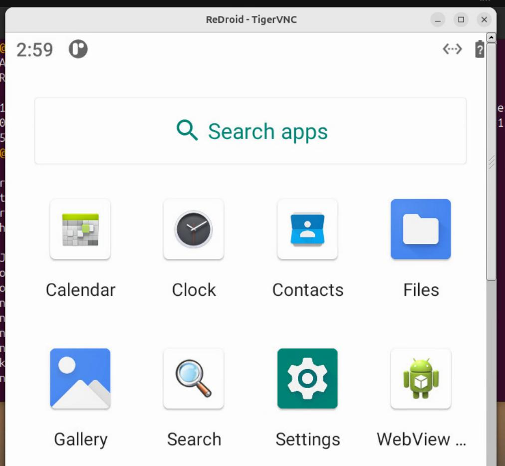

# 20260622
### 1. r11 vnc building
sync to specified version:      

```
repo init -u https://github.com/remote-android/platform_manifests.git -b redroid-11.0.0
repo sync -c
cd .repo/manifests
git checkout 5cd2b0e
cd ../../
repo sync -c --force-sync --no-manifest-update
# sync twice to make sure nothing left(error)
repo sync -c --force-sync --no-manifest-update
repo forall -c "git lfs pull"
# examine the prebuilt: 
dash@horse:/media/big/vnc/a11_vnc/external/chromium-webview/prebuilt$ sudo du -hs *
52M	arm
94M	arm64
63M	x86
107M	x86_64
```
Change from pre-builts to self-building:       

```
$ vim device/redroid-prebuilts/prebuilts.mk
- vncserver \
$ vim device/redroid-prebuilts/Android.mk
## libvncserver
#vncserver_libs := libvncserver

#$(eval $(call define-redroid-prebuilt-bin,vncserver,$(vncserver_libs),vncserver/vncserver    .rc))


define define-redroid-prebuilt-bink
include $(CLEAR_VARS)
# 给这个模块起个新名字，不要和原本的冲突
LOCAL_MODULE := vncserver_rc_only
LOCAL_MODULE_CLASS := ETC
# 将文件安装到 init 目录
LOCAL_MODULE_PATH := $(TARGET_OUT_ETC)/init
# 指向你的 rc 文件
LOCAL_SRC_FILES := prebuilts/$(TARGET_ARCH)/share/vncserver/vncserver.rc
LOCAL_MODULE_TAGS := optional
LOCAL_PROPRIETARY_MODULE := true
include $(BUILD_PREBUILT)
endef

$(eval $(call define-redroid-prebuilt-bink,vncserver/vncserver.rc))

这里我们需要保留vncserver.rc, 因为后面我们即便使用自己编译的版本，也需要这个rc文件来唤起。   
$ vim frameworks/native/libs/binder/include/binder/IInterface.h +250
+    "android.hardware.input.IInputManager",
$ vim device/redroid/redroid.mk
PRODUCT_PACKAGES += \
    libvncserver \
    vncserver \
```
Build via:     

```
dash@horse:/media/big/vnc/a11_vnc$  sudo docker run -it -v `pwd`:/mnt/lineage -v /home/dash/ccache11:/ccache waydroid-build-24.04:aosp16build /bin/bash
root@28051912e278:/#

cd /mnt/lineage/

export USE_CCACHE=1
export CCACHE_COMPRESS=1
export CCACHE_DIR="/ccache"
export CCACHE_EXEC=/usr/bin/ccache
export CCACHE_SLOPPINESS="file_macro,locale,time_macros,include_file_mtime,pch_defines,modules"
export CCACHE_HARDLINK=1
${CCACHE_EXEC} -M  50G
git config --global --add safe.directory "*"

. build/envsetup.sh
lunch redroid_x86_64-userdebug
time make -j24

#### build completed successfully (53:45 (mm:ss)) ####


real	53m45.036s
user	932m33.573s
sys	47m36.186s
```
Verification:      

```
 1 test@nuc11test:~$  sudo docker run -itd --memory-swappiness=0 --privileged -p 5559:5555 -p 15909:5900  myr11vnc redroid.gpu.mode=host androidboot.use_memfd=1 redroid.vncserver=1 androidboot.use_redroid_stream=1 redroid.gpu.node=/dev/dri/renderD128 androidboot.use_redroid_vnc=1
WARNING: Your kernel does not support memory swappiness capabilities or the cgroup is not mounted. Memory swappiness discarded.
7a50154ab6e6a203fc3b6177121a229fed59eaf097213bd6d4a8786890fe7dcb
test@nuc11test:~$ sudo docker ps
CONTAINER ID   IMAGE      COMMAND                  CREATED         STATUS         PORTS                                                                                        NAMES
7a50154ab6e6   myr11vnc   "/init qemu=1 androi…"   4 seconds ago   Up 3 seconds   0.0.0.0:5559->5555/tcp, [::]:5559->5555/tcp, 0.0.0.0:15909->5900/tcp, [::]:15909->5900/tcp   exciting_khorana
test@nuc11test:~$ sudo docker exec -it 7a50154ab6e6 sh
7a50154ab6e6:/ # getprop | grep boot | grep com                                              
[dev.bootcomplete]: [1]
[ro.boottime.vendor.hwcomposer-2-1]: [1962286621821]
[sys.boot_completed]: [1]
[sys.bootstat.first_boot_completed]: [1]
7a50154ab6e6:/ # dumpsys SurfaceFlinger | grep GLES
GLES: Intel, Mesa Intel(R) Xe Graphics (TGL GT2), OpenGL ES 3.2 Mesa 24.0.8 (git-441f064c1c)
```



### 2. r13 vnc
Steps:     

```
 mkdir vnca13preview
 cd vnca13preview/
 repo init -u https://github.com/remote-android/platform_manifests.git  -b      redroid-t-preview-1
 export REPO_URL='https://mirrors.bfsu.edu.cn/git/git-repo'
 repo sync -c
接下来的更改和r11下vnc的更改一样，主要是更改vncserver/libvncserver从预编译换成编译。
```

为了解决以下issue:      

```
[100% 1/1] analyzing Android.bp files and generating ninja file at out/soong/build.ninja
FAILED: out/soong/build.ninja
cd "$(dirname "out/host/linux-x86/bin/soong_build")" && BUILDER="$PWD/$(basename "out/host/linux-x86/bin/soong_build")" && cd / && env -i  "$BUILDER"     --top "$TOP"     --soong_out "out/soong"     --out "out"     -o out/soong/build.ninja --globListDir build --globFile out/soong/globs-build.ninja -t -l out/.module_paths/Android.bp.list --available_env out/soong/soong.environment.available --used_env out/soong/soong.environment.used.build Android.bp
error: external/rust/crates/zip/Android.bp:21:1: "libzip" depends on undefined module "libflate2"
07:11:06 soong bootstrap failed with: exit status 1
#### failed to build some targets (10 seconds) ####
```
```
mkdir -p external/rust/crates/flate2

cd external/rust/crates/flate2
git init
git remote add origin https://android.googlesource.com/platform/external/rust/crates/flate2
git fetch origin
git checkout android-13.0.0_r1
```

### 3. nodejs
Ubuntu20.04, install node 23.x via:      

```
  curl -fsSL https://deb.nodesource.com/setup_23.x | sudo -E bash -
  sudo apt install -y nodejs
test@ubuntu2004:~$ nodejs --version
v23.11.1

```
