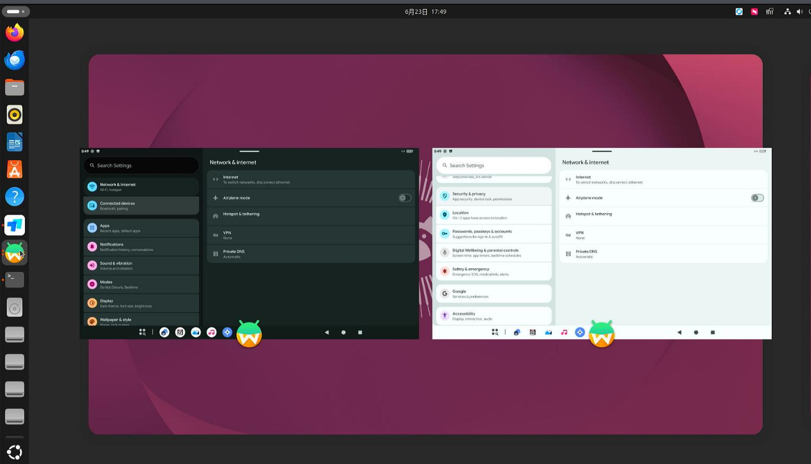

# 20260623
### 1. waydroid(redroid)startup

```
$ cat startwaydroid.sh
sudo docker run --privileged \
  -v $XDG_RUNTIME_DIR/$WAYLAND_DISPLAY:/run/xdg/wayland-0 \
  -v /home/dash/data1:/data \
  -p 5555:5555 \
  -it supechicken/waydroid:lineage-23.2 \
  ro.hardware.hwcomposer=waydroid
sudo docker run --privileged \
  -v $XDG_RUNTIME_DIR/$WAYLAND_DISPLAY:/run/xdg/wayland-0 \
  -v /home/dash/data2:/data \
  -p 5556:5555 \
  -it supechicken/waydroid:lineage-23.2 \
  ro.hardware.hwcomposer=waydroid
```
Effect:    



