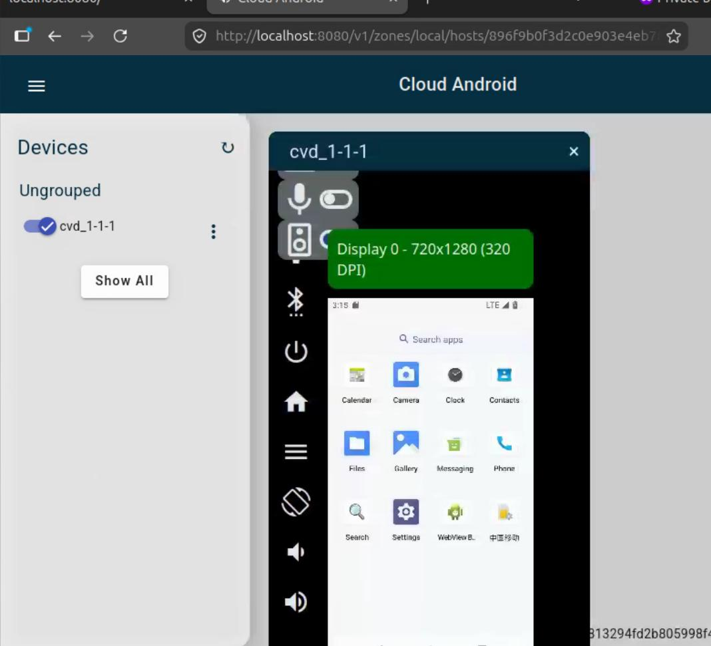
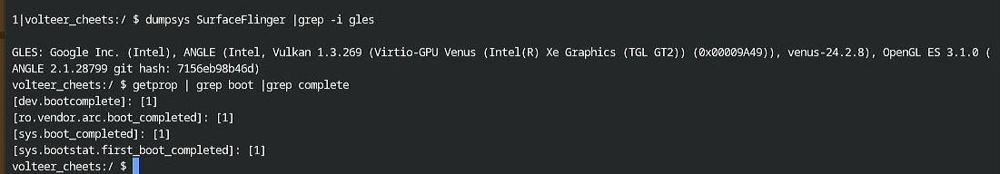

# 20260629
### 1. Run cuttlefish in docker
Steps:     

```
sudo docker pull us-docker.pkg.dev/android-cuttlefish-artifacts/cuttlefish-orchestration/cuttlefish-cloud-orchestrator:unstable
mkdir cf
cd cf
wget -O conf.toml https://artifactregistry.googleapis.com/download/v1/projects/android-cuttlefish-artifacts/locations/us/repositories/cloud-orchestrator-config/files/on-premise-single-server:unstable:conf.toml:download?alt=media
mkdir dist
mv ~/Downloads/cvd-host_package.tar.gz dist/
mv ~/Downloads/aosp_cf_x86_64_phone-img-15601458.zip dist/

sudo curl -fsSL https://us-apt.pkg.dev/doc/repo-signing-key.gpg -o /etc/apt/keyrings/android-cuttlefish-artifacts.asc
sudo chmod a+r /etc/apt/keyrings/android-cuttlefish-artifacts.asc
echo   "deb [arch=$(dpkg --print-architecture) signed-by=/etc/apt/keyrings/android-cuttlefish-artifacts.asc] \
  https://us-apt.pkg.dev/projects/android-cuttlefish-artifacts android-cuttlefish-unstable main" |   sudo tee /etc/apt/sources.list.d/android-cuttlefish-artifacts.list > /dev/null
sudo apt update
sudo apt install cuttlefish-cvdremote
cvdr --help

$ cat ~/cf/conf.toml 
    WebStaticFilesPath = "web"
    
    # List of allowed origins
    # e.g. "https://localhost:8080"
    CORSAllowedOrigins = []
    
    [AccountManager]
    Type = "username-only"
    
    [AccountManager.OAuth2]
    Provider = "Google"
    RedirectURL = "http://localhost:8080/oauth2callback"
    
    [SecretManager]
    Type = ""
    
    [EncryptionService]
    Type = "Fake"
    
    [DatabaseService]
    Type = "InMemory"
    
    [InstanceManager]
    Type = "docker"
    HostOrchestratorProtocol = "http"
    AllowSelfSignedHostSSLCertificate = true
    
    [InstanceManager.Docker]
    DockerImageName = "us-docker.pkg.dev/android-cuttlefish-artifacts/cuttlefish-orchestration/cuttlefish-orchestration:1.49-5813294f"
    HostOrchestratorPort = 2080
    
    [[WebRTC.IceServers]]
    URLs = ["stun:stun.l.google.com:19302"]
$ sudo docker pull us-docker.pkg.dev/android-cuttlefish-artifacts/cuttlefish-orchestration/cuttlefish-orchestration:1.49-5813294f
$ sudo docker run -d     -p 8080:8080     -e CONFIG_FILE="/conf.toml"     -v $PWD/conf.toml:/conf.toml     -v /var/run/docker.sock:/var/run/docker.sock     -t us-docker.pkg.dev/android-cuttlefish-artifacts/cuttlefish-orchestration/cuttlefish-cloud-orchestrator:unstable
$ cat ~/.config/cvdr/cvdr.toml 
    # Configuration for the cvdr program when the Cloud Android Orchestration
    # service uses DockerInstanceManager.
    
    # Default service
    SystemDefaultService = "dockerIM"
    
    [Services.dockerIM]
    
    # ServiceURL should be the full path to the service API without including the
    # api version.
    # Please set `CLOUD_ORCHESTRATOR_IP_ADDRESS` according to your cloud
    # orchestrator deployment. Typically this is the IP address of your server.
    # ServiceURL = "http://${CLOUD_ORCHESTRATOR_IP_ADDRESS}:8080"
    ServiceURL = "http://localhost:8080"
    
    # The zone where the users' host VMs will be created.
    Zone = "local"
    
    # The proxy URL.
    # When this configuration is required, please uncomment below configuration and
    # set `SOCKS5_PORT` according to your SSH dynamic port forwarding.
    # Proxy = "socks5://localhost:${SOCKS5_PORT}"
    
    # The configuration for cvdr to get your username from the unix system.
    # This is required when the Cloud Android Orchestration service uses
    # UsernameOnlyAccountManager.
    Authn = {
      HTTPBasicAuthn = {
        UsernameSrc = "unix"
      }
    }
    
    # The host config for the Cloud Android Orchestration service.
    Host = {}
    
    # Agent name used for ADB connection.
    ConnectAgent = "websocket"
    
    BuildAPICredentialsSource = "none"
$ cvdr create --local_cvd_host_pkg_src=`pwd`/dist/cvd-host_package.tar.gz --local_images_zip_src=`pwd`/dist/aosp_cf_x86_64_phone-img-15601458.zip
Creating Host........................................ OK
Uploading "cvd-host_package.tar.gz".................. OK
Extracting archives and preparing image directory.... OK
Uploading "aosp_cf_x86_64_phone-img-15601458.zip".... OK
Extracting archives and preparing image directory.... OK
Fetching, starting and waiting for boot complete..... OK
Connecting to cvd_1/1................................ Failed to connect ADB to device: unable to contact ADB server: dial tcp 127.0.0.1:5037: connect: connection refused
Waiting connection from ADB server timed out: accept tcp 127.0.0.1:38951: i/o timeout
Connecting to cvd_1/1................................ Failed
Host: 896f9b0f3d2c0e903e4eb7889803ebbf0563a998133e8131a1393a385e82ba2d
  WebUI: http://localhost:8080/v1/zones/local/hosts/896f9b0f3d2c0e903e4eb7889803ebbf0563a998133e8131a1393a385e82ba2d/
  Group: cvd_1
    Instance: 1
      Status: Running
      ADB: not connected
      Displays: [720 x 1280 ( 320 )]
      Logs: http://localhost:8080/v1/zones/local/hosts/896f9b0f3d2c0e903e4eb7889803ebbf0563a998133e8131a1393a385e82ba2d/cvds/cvd_1/1/logs/
1 error occurred:
* failed to connect to device: no response from agent
```
Examine via:     

```
sudo docker inspect 896f9b0f3d2c |grep 172
adb connect 172.17.0.6:6520
adb devices
adb shell
vsoc_x86_64:/ $ dumpsys SurfaceFlinger | grep GLES
GLES: Google Inc. (Google), ANGLE (Google, Vulkan 1.3.0 (SwiftShader Device (LLVM 16.0.0) (0x0000C0DE)), SwiftShader driver-5.0.0), OpenGL ES 3.1.0 (ANGLE 2.1.22913 git hash: 0c140a7dade8)
```
Visit:    

`  WebUI: http://localhost:8080/v1/zones/local/hosts/896f9b0f3d2c0e903e4eb7889803ebbf0563a998133e8131a1393a385e82ba2d/`:    



Limitation:      

```
Multiple instances on x86_64: Due to the technical issue around vhost_user_vsock, currently it's not available to create multiple Cuttlefish instances across multiple docker instances on x86_64 machine.
GPU acceleration: GPU acceleration is not supported yet with this setup.
```
### 2. lineageos-23.2
repo sync:       

```
$ repo init -u https://github.com/LineageOS/android.git -b lineage-23.2 --git-lfs --no-clone-bundle
$ cat .repo/manifests/default.xml
<?xml version="1.0" encoding="UTF-8"?>
<manifest>
  <remote  name="github"
           fetch="https://github.com/" />

  <remote  name="lineage"
           fetch="https://mirrors.bfsu.edu.cn/git/lineageOS/"
           review="review.lineageos.org" />

  <remote  name="private"
           fetch="ssh://git@github.com" />

  <remote  name="aosp"
           fetch="https://mirrors.bfsu.edu.cn/git/AOSP"
           review="android-review.googlesource.com"
           revision="refs/tags/android-16.0.0_r4" />

  <default revision="refs/heads/lineage-23.2"
           remote="lineage"
           sync-c="true"
           sync-j="4" />
$ repo sync
```
### 3. chromeos working items
Enter linux shell:     

```
ctrl+alt+T, crosh
shell
vmc start termina
```
Enter adb:     

```
adb connect arc
adb shell
```


