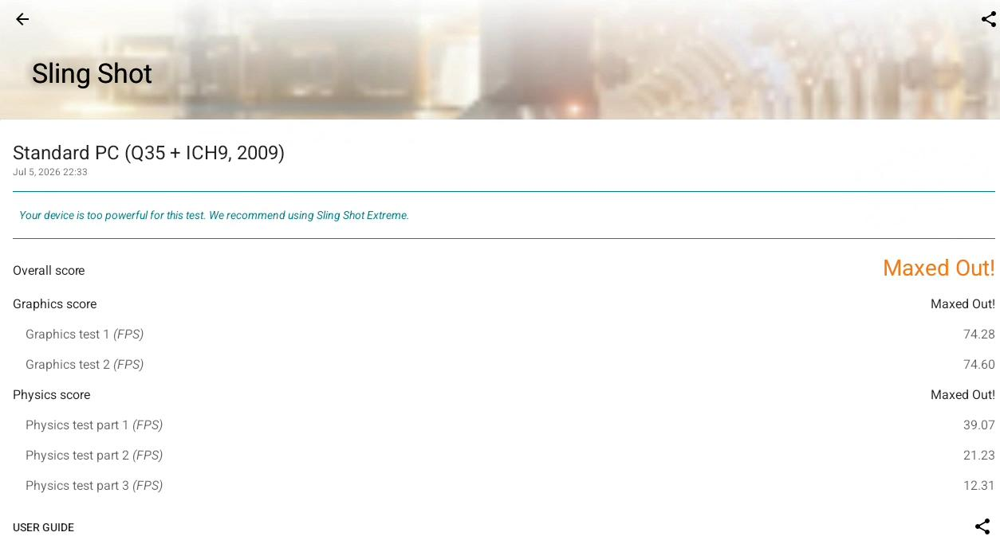
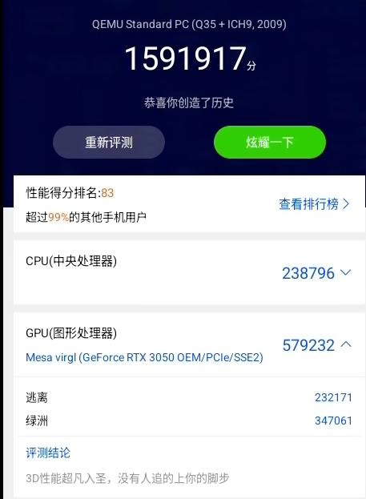

# 20260706
### 1. RockyLinux Virgl
Install libvirt/qemu/virt-manager via:    

```
sed -e 's|^mirrorlist=|#mirrorlist=|g'     -e 's|^#baseurl=http://dl.rockylinux.org/$contentdir|baseurl=https://mirrors.ustc.edu.cn/rocky|g'     -i.bak     /etc/yum.repos.d/rocky-extras.repo     /etc/yum.repos.d/rocky.repo
yum makecache
yum install -y virt-manager
sudo dnf group install "Virtualization Host"
vim /etc/selinux/config 
systemctl disable firewalld
yum install -y edk2-ovmf
/usr/libexec/qemu-kvm --version
```
Configure network:     

```
# 创建 br0 接口，并设置静态 IP、网关和 DNS
sudo nmcli connection add type bridge con-name br0 ifname br0 \
ipv4.addresses 192.168.1.166/24 \
ipv4.gateway 192.168.1.33 \
ipv4.dns 223.5.5.5 \
ipv4.method manual
# 将 enp3s0 连接改为 bridge-slave 类型，并指定 master 为 br0
# 请将 <你的旧连接名> 替换为实际查看到的名称（例如 "Wired connection 1"）
sudo nmcli connection modify "<你的旧连接名>" master br0
sudo nmcli connection modify br0 bridge.stp no
# 停掉旧的网卡连接，启动网桥
sudo nmcli connection down "<你的旧连接名>"
sudo nmcli connection up br0
# sudo reboot
```
### 2. lineageos building(virtio)
build via `lunch aosp_virtio_x86_64-trunk_staging-userdebug`:    

```
[100% 2/2] analyzing Android.bp files and generating ninja file at out/soong/build.aosp_virtio
FAILED: out/soong/build.aosp_virtio_x86_64.ninja
cd "$(dirname "out/host/linux-x86/bin/soong_build")" && BUILDER="$PWD/$(basename "out/host/lin
ux-x86/bin/soong_build")" && cd / && env -i  "$BUILDER"     --top "$TOP"     --soong_out "out/
soong"     --out "out"     --soong_variables out/soong/soong.aosp_virtio_x86_64.variables -o o
ut/soong/build.aosp_virtio_x86_64.ninja --kati_suffix -aosp_virtio_x86_64 --kati_enabled -l ou
t/.module_paths/Android.bp.list --available_env out/soong/soong.environment.available --used_e
nv out/soong/soong.environment.used.aosp_virtio_x86_64.build Android.bp
error: external/libjxl/Android.bp:17:1: dependency "libskia_skcms" of "libjxl" missing variant
:
  os:android,image:vendor,link:static
available variants:
  os:linux_glibc,arch:x86_64,link:static
  os:linux_glibc,arch:x86,link:static
  os:windows,arch:x86,link:static
  os:windows,arch:x86_64,link:static
  os:android,arch:x86_64_sandybridge,link:static
  os:android,arch:x86_64_sandybridge,sdk:sdk,link:static
error: external/libjxl/Android.bp:17:1: dependency "libhwy" of "libjxl" missing variant:
  os:android,image:vendor,link:static
available variants:
  os:linux_glibc,arch:x86_64,link:static
  os:linux_glibc,arch:x86_64,link:shared
  os:linux_glibc,arch:x86,link:static
  os:linux_glibc,arch:x86,link:shared
  os:windows,arch:x86,link:static
  os:windows,arch:x86,link:shared
  os:windows,arch:x86_64,link:static
  os:windows,arch:x86_64,link:shared
  os:android,arch:x86_64_sandybridge,link:static
  os:android,arch:x86_64_sandybridge,link:shared
  os:android,arch:x86_64_sandybridge,sdk:sdk,link:static
  os:android,arch:x86_64_sandybridge,sdk:sdk,link:shared
08:37:13 soong bootstrap failed with: exit status 1

#### failed to build some targets (12 seconds) ####


real	0m12.415s
user	1m59.461s
sys	0m6.529s

```
### 3. virgl(qemu)
rocky qemu:     

```
sudo dnf install virglrenderer-devel libepoxy-devel mesa-libGL-devel

# 修改后的配置命令示例
./configure --enable-modules \
            --target-list=x86_64-softmmu \
            --enable-debug \
            --disable-docs \
            --enable-virglrenderer \
            --enable-opengl \
            --prefix=/opt/local \
            --enable-virtfs \
            --enable-libusb \
            --disable-debug-tcg \
            --audio-drv-list=pa \
            --enable-usb-redir \
            --enable-spice \
            --enable-spice-protocol
```

### 4. virgl(rockylinux)
kernel module:    

```
[root@rocky95 ~]# sudo lspci -vvnn -s 01:00.0 | grep -i 'in use'
	Kernel driver in use: nouveau
```
Score:    




Install kernel(official):    

```
sudo dnf config-manager --set-enabled crb
sudo dnf install epel-release -y
更新系统并安装内核开发包：
(安装驱动需要与当前运行内核版本完全匹配的开发头文件)

sudo dnf update -y
sudo dnf install kernel-devel-matched kernel-headers gcc make dkms -y
注意：如果上述更新了内核，请务必先 sudo reboot 重启系统，进入最新内核后再执行后续操作。

第二步：配置 NVIDIA 仓库
使用 NVIDIA 官方提供的 RHEL 9 仓库，这样可以获取最新的驱动支持：

# 添加官方仓库
sudo dnf config-manager --add-repo https://developer.download.nvidia.com/compute/cuda/repos/rhel9/x86_64/cuda-rhel9.repo
sudo dnf clean expire-cache
第三步：安装驱动

# 安装最新的驱动程序 (DKMS 模式)
sudo dnf module install nvidia-driver:latest-dkms -y
```
enable virgl:     

```
1. 确保 NVIDIA 驱动支持渲染节点
首先确认 nvidia-drm 开启了模式设置（modeset），否则 EGL 无法通过 NVIDIA 节点渲染。

执行命令检查：cat /sys/module/nvidia_drm/parameters/modeset

如果显示 N，请在 /etc/default/grub 中 GRUB_CMDLINE_LINUX 增加 nvidia-drm.modeset=1，然后执行 sudo grub2-mkconfig -o /boot/grub2/grub.cfg (或 UEFI 对应的路径) 并重启。

2. 修改 Libvirt Cgroup ACL (关键步骤)
Libvirt 默认不允许 QEMU 访问 NVIDIA 的设备节点（如 /dev/nvidia0）。你需要修改 /etc/libvirt/qemu.conf 以允许这些设备。

编辑 /etc/libvirt/qemu.conf，找到 cgroup_device_acl 并添加 NVIDIA 设备：

Code snippet


cgroup_device_acl = [
    "/dev/null", "/dev/full", "/dev/zero",
    "/dev/random", "/dev/urandom",
    "/dev/ptmx", "/dev/kvm", "/dev/dri/renderD128",
    "/dev/nvidia0", "/dev/nvidiactl", "/dev/nvidia-modeset"
]
提示：如果你的系统有多个 NVIDIA 设备或编号不同，请检查 /dev/nvidia* 的具体权限。

完成后，重启 Libvirt 服务：

sudo systemctl restart libvirtd
```



