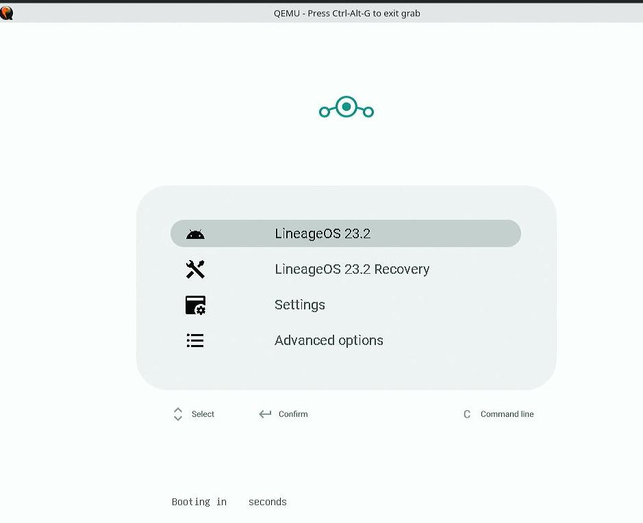
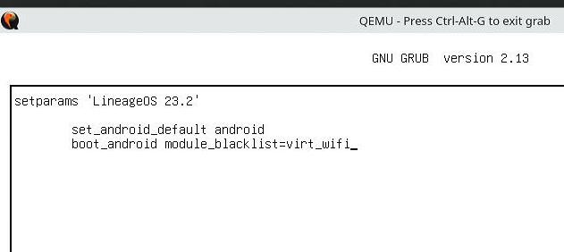
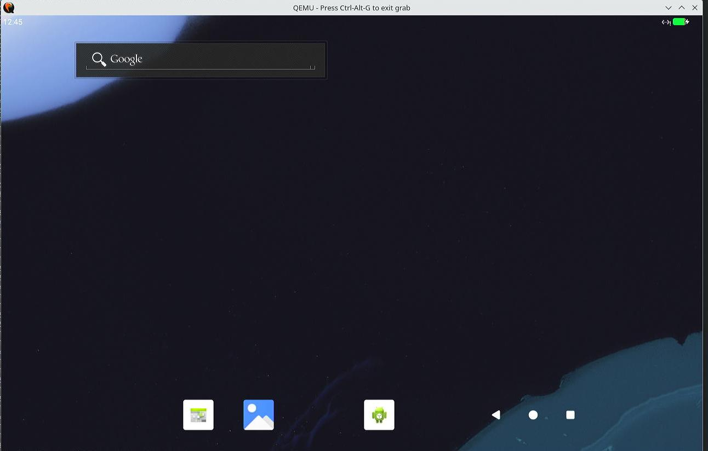
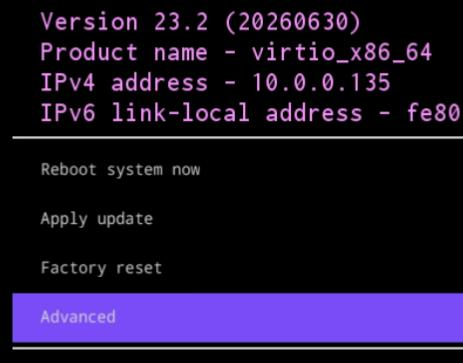
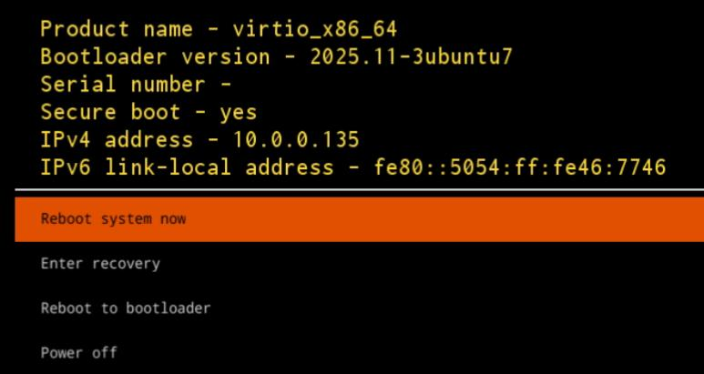
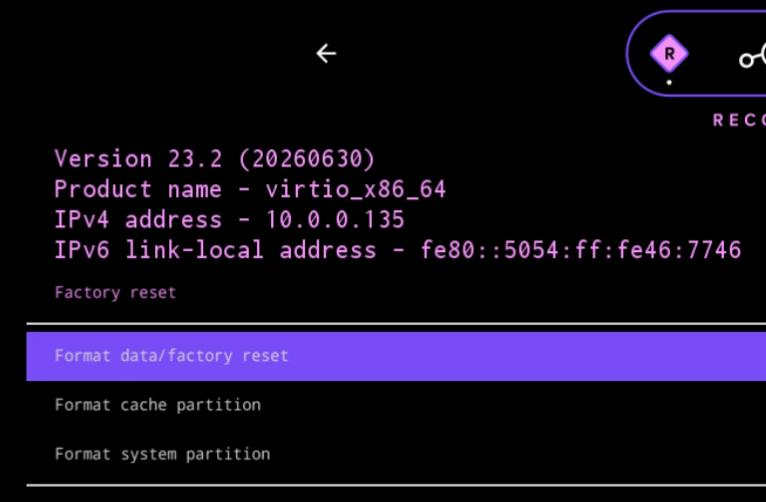

# 20260707
### 1. WorkingTips On android-lineage-qemu
Download the release files from `https://github.com/jqssun/android-lineage-qemu/releases`, e.g:    

```
axel https://github.com/jqssun/android-lineage-qemu/releases/download/v2026.06.27/UTM-VM-lineage-23.2-20260627-jqssun-virtio_arm64only.zip
```
Transfer it to arm machine(e.g feiteng d3000):     


```
cd utm && cd utm
 unzip ../UTM-VM-lineage-23.2-20260627-jqssun-virtio_arm64only.zip

read -r -d '' QEMU_OPTS << EOM
    -device virtio-blk-pci,drive=vda,bootindex=0 \
    -device virtio-blk-pci,drive=vdb,bootindex=1 \
    -drive if=pflash,unit=1,file=$(find ./LineageOS_on_*.utm/Data/efi_vars.fd) \
    -drive file=$(find ./LineageOS_on_*.utm/Data/vda.qcow2),if=none,id=vda,discard=unmap,detect-zeroes=unmap \
    -drive file=$(find ./LineageOS_on_*.utm/Data/vdb.qcow2),if=none,id=vdb,discard=unmap,detect-zeroes=unmap \
    -device virtio-net-pci,netdev=net0 \
    -netdev user,id=net0,hostfwd=tcp:0.0.0.0:5555-:5555,hostfwd=tcp:0.0.0.0:5554-:5554 \
    -device usb-tablet,bus=usb-bus.0 \
    -device usb-mouse,bus=usb-bus.0 \
    -device usb-kbd,bus=usb-bus.0 \
    -device virtio-serial \
    -device virtio-rng-pci \
    -chardev stdio,mux=on,id=charconsole \
    -serial chardev:charconsole
EOM

read -r -d '' LINUX_QEMU_OPTS << EOM                                                                                               
    -device virtio-gpu-gl-pci -display sdl,gl=on     -drive if=pflash,unit=0,file=$VMF_CODE,file.locking=off,format=raw,readonly=on     -device usb-ehci,id=usb-bus     $QEMU_OPTS
EOM

qemu-system-$(uname -m)     -machine virt,gic-version=3,highmem=on     -cpu host -smp 4 -m 8192     -accel kvm     $LINUX_QEMU_OPTS
```

Press `E` for editing the grub items:    



Add `module_blacklist=virt_wifi`, avoiding the boot kernel failure:      



Ctrl+x for booting the vm: 

```
virtio_arm64only:/ $ dumpsys SurfaceFlinger | grep GLES
 ------------RE GLES (Ganesh)------------
GLES: Mesa, virgl (AMD Radeon RX 550 / 550 Series (radeonsi, polaris12,...), OpenGL ES 3.2 Mesa 25.3.3
```
### 2. non-virgl configuration
via:     

```
read -r -d '' LINUX_QEMU_OPTS << EOM                                                                                               
    -device virtio-gpu-pci -display sdl,gl=off     -drive if=pflash,unit=0,file=$VMF_CODE,file.locking=off,format=raw,readonly=on     -device usb-ehci,id=usb-bus     $QEMU_OPTS
EOM
```
### 3. reason for  `virt_wifi`
Reason:    

```
virt_wifi.ko 是预编译（prebuilt）的
它不是在你这台虚拟机上现场编译的，而是别人提前编译好、打包进 LineageOS 镜像里的一个现成文件。
没有 SCS instrumentation（没有启用 Shadow Call Stack 保护）  SCS 是 Linux 内核在 ARM64 上的一种安全保护机制（类似“影子调用栈”），用来防止黑客通过栈溢出等手段攻击系统。
你的当前内核 开启了这个保护（CONFIG_SHADOW_CALL_STACK=y）。
但 virt_wifi.ko 这个模块编译时没有开启这个保护。

编译配置或编译器不一致
模块和内核必须使用几乎完全相同的编译选项才能安全加载（尤其是安全相关选项如 SCS、页面大小、指针认证等）。
这里明显不一致，导致内核在加载模块、处理函数调用栈信息时，访问了无效内存，触发了页面错误（paging request）并崩溃。

通俗比喻：就像你有一把新锁（开启了 SCS 的新内核），但钥匙（virt_wifi.ko）是老款的，插不进去，还把锁弄坏了（内核 panic）。
```
### 4. gsi image
script for starting instance with gsi:      

```
#!/bin/bash
VMF_CODE=$(find /usr/share/ -name $([ "$(uname -m)" = "x86_64" ] && echo OVMF_CODE_4M || echo AAVMF_CODE).fd 2>/dev/null)

read -r -d '' QEMU_OPTS << EOM
    -device virtio-blk-pci,drive=vda,bootindex=0 \
    -device virtio-blk-pci,drive=vdb,bootindex=1 \
    -device virtio-blk-pci,drive=vdc \
    -drive if=pflash,unit=1,file=$(find ./LineageOS_on_*.utm/Data/efi_vars.fd) \
    -drive file=$(find ./LineageOS_on_*.utm/Data/vda.qcow2),if=none,id=vda,discard=unmap,detect-zeroes=unmap \
    -drive file=$(find ./LineageOS_on_*.utm/Data/vdb.qcow2),if=none,id=vdb,discard=unmap,detect-zeroes=unmap \
    -drive file=./LineageOS_on_arm64.utm/Data/system.img,if=none,id=vdc,discard=unmap,detect-zeroes=unmap \
    -device virtio-net-pci,netdev=net0 \
    -netdev user,id=net0,hostfwd=tcp:0.0.0.0:5555-:5555,hostfwd=tcp:0.0.0.0:5554-:5554 \
    -device usb-tablet,bus=usb-bus.0 \
    -device usb-mouse,bus=usb-bus.0 \
    -device usb-kbd,bus=usb-bus.0 \
    -device virtio-serial \
    -device virtio-rng-pci \
    -chardev stdio,mux=on,id=charconsole \
    -serial chardev:charconsole
EOM

echo $QEMU_OPTS

read -r -d '' LINUX_QEMU_OPTS << EOM
    -device virtio-gpu-gl-pci -display sdl,gl=on     -drive if=pflash,unit=0,file=$VMF_CODE,file.locking=off,format=raw,readonly=on     -device usb-ehci,id=usb-bus     $QEMU_OPTS
EOM

qemu-system-$(uname -m)     -machine virt,gic-version=3,highmem=on     -cpu host -smp 4 -m 8192     -accel kvm     $LINUX_QEMU_OPTS
```
Then in host:    

```
fastboot -s tcp:127.0.0.1:5554 delete-logical-partition product
fastboot -s tcp:127.0.0.1:5554 delete-logical-partition system_ext
fastboot -s tcp:127.0.0.1:5554 flash system ./LineageOS_on_arm64.utm/Data/system.img
fastboot -s tcp:127.0.0.1:5554 format userdata
fastboot -s tcp:127.0.0.1:5554 reboot
```
Reboot the guest. Next time wipe the data partition.    



### 5. make gsi image
build aosp16:   

```
. buildenv/setup.sh
lunch aosp_x86_64-trunk_staging-userdebug
m gsi_system_image -j20
``` 

### 6. fastboot
advanced:   



Enter fastboot:    




reboot then format /data/factory reset



