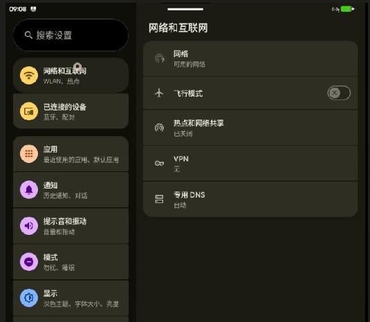
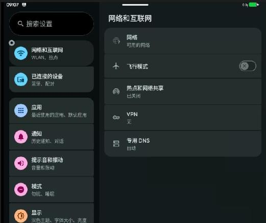

# 20260709
### 1. color issue


vs




```
这有两张照片，是在virt-manager下启动lineageOS（virtio_x86_64)的截图，两张的不同是是否启用了<acceleration accel3d='no'/>， 其中发绿的那一张是没有启用的，正常的那张是启用了的。为什么会有这样的问题呢？

这是一个在虚拟化和容器化运行 Android 系统（如 LineageOS）时非常经典的 色彩通道/字节序不匹配（Color Channel / Endianness Mismatch） 现象。

简单来说，当你在 virt-manager 中关闭 3D 加速时，屏幕画面整体发绿（准确地说是偏青/绿，且原本应该是红色的图标可能变成了蓝色或相反），而开启 3D 加速后色彩恢复正常。

以下是导致这个问题的根本原因：

1. 软件渲染与硬件渲染的“语言”不通 (RGBA  vs BGRA)
在 Linux 虚拟化环境中，Android 系统的表面投射（Surface Flinger / Gralloc）需要将渲染好的图像像素数据传给宿主机的显示窗口（如 QEMU 的 GTK 或 Spice 界面）。

启用 3D 加速时（<acceleration accel3d='yes'/>）： 系统使用的是硬件加速渲染。此时 Android 内部的图形驱动（通常是通过 VirGL 或者是宿主机的 GPU）与 QEMU 之间通过统一的现代图形 API（如 OpenGL/Vulkan）直接对话。它们在传递像素时，对颜色通道的定义是高度一致的（通常是标准 RGBA），所以颜色显示完全正常。

禁用 3D 加速时（<acceleration accel3d='no'/>）：
Android 只能回退到软件渲染（Software Rendering），使用 CPU 来计算每一个像素。在这个过程中，QEMU 的虚拟显卡（如 virtio-vga 或 stdvga）在接收这些纯内存像素数据时，可能会发生字节序（Endianness）或者颜色通道顺序（Bgr vs Rgb）的解析错位。

2. 为什么偏偏是“变绿”？
我们可以通过色彩通道的转换来推导这个现象：
假设图像原本的像素格式是 RGBA（红、绿、蓝、透明度），但禁用 3D 加速后的软件 framebuffer 被宿主机误识别成了 BGRA（蓝、绿、红、透明度）。

红色 (R) 与 蓝色 (B) 互换了位置。

绿色 (G) 刚好在正中间，位置没有变。

当红蓝通道互换，而绿色通道保持不变且权重叠加时，原本红色的元素会变蓝，原本蓝色的元素会变红，而整个系统界面的中间色调和白色背景极易偏向青绿色（Cyan/Green）。仔细观察两张截图左侧的图标：

在正常那张图中，第三个图标（应用）是红/橙色的，而在发绿的那张图中，它变成了蓝色。

正常的“显示”图标是橙色，发绿图中变成了蓝色。

这证实了 Red ↔ Blue 通道互换 的猜想。

如何解决或绕过这个问题？
如果你因为某些原因必须关闭 3D 加速，但又不想看到原生态的“绿屏”，可以尝试以下几种解决方法：

更换 QEMU 的视频设备（Video Device）：
在 virt-manager 的虚拟机详情中，找到 图形/视频 (Video) 硬件，将型号在 Virtio、GXL、QXL 或 Standard VGA 之间切换。不同的虚拟显卡驱动在处理软件渲染时的字节序可能不同。

修改 LineageOS 的启动参数（Grub）：
在 Android x86 系系统中，可以在启动项（Grub）的内核参数后面尝试添加以下参数之一，强制指定色彩深度或驱动行为：

VGA=788 (或其他标准的 VESA 模式)

EXTMOD=android_x86

使用 Spice 协议代替 VNC：
在“显示 (Display)”设置中，确保使用的是 Spice server 而不是 VNC，Spice 协议对各种像素格式的兼容性和自动转换做得比传统 VNC 或纯 GTK 窗口更好。

总结： 建议在硬件支持的情况下保持开启 3D 加速。Android 作为一个移动端系统，其 UI 架构（SurfaceFlinger）极度依赖 GPU 硬件混合渲染，关闭 3D 加速不仅会导致色彩通道错乱，还会带来巨大的 CPU 性能消耗和操作卡顿。
```
### 2. libvirt(720x1280)
Edit xml via:      

```
    <video>
      <model type='virtio' heads='1' primary='yes'>
        <acceleration accel3d='no'/>
        <resolution x='800' y='1280'/>
      </model>
      <alias name='video0'/>
      <address type='pci' domain='0x0000' bus='0x00' slot='0x01' function='0x0'/>
    </video>
```
### 3. enable developer mode
Modification:     

```
dash@horse:/media/nvme/jun29_232/lineage23.2/device/virt/virt-common$ cat ./overlays/rro_overlays/LowPerformanceSettingsProviderOverlay/res/values/defaults.xml | grep def_development_settings_enabled
    <integer name="def_development_settings_enabled">1</integer>
dash@horse:/media/nvme/jun29_232/lineage23.2/device/virt/virt-common$ pwd
/media/nvme/jun29_232/lineage23.2/device/virt/virt-common
dash@horse:/media/nvme/jun29_232/lineage23.2/device/virt/virt-common$ grep "def_development_settings_enabled" ./ -r
./overlays/rro_overlays/LowPerformanceSettingsProviderOverlay/res/values/defaults.xml:    <integer name="def_development_settings_enabled">1</integer>
./overlays/overlay/frameworks/base/packages/SettingsProvider/res/values/defaults.xml:    <integer name="def_development_settings_enabled">1</integer>
```
But the configuration is not take effects.    
