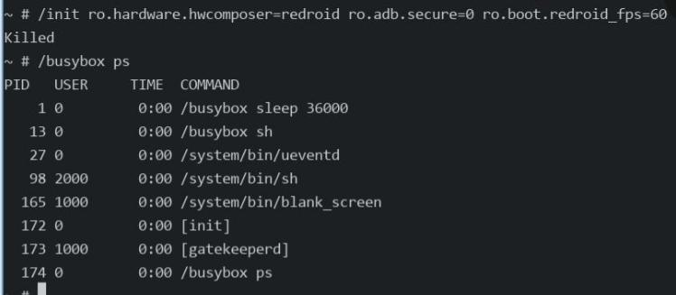

# 20260723
### 1. RE-compact waydroid iamge
Repack the new image:    

```
sudo apt install erofs-utils e2fsprogs
mkdir system_extracted
sudo fsck.erofs --extract=system_extracted system.img

sudo cp busybox  system_extracted/
sudo chmod 777 system_extracted/busybox

sudo mkfs.ext4 -d system_extracted/ system_rw.img 5000M
mv system.img system.img.bak
mv system_rw.img system.img

RE-pack
```
Then:      

```
sudo mount system.img system -o ro && sudo mount vendor.img vendor -o ro && sudo tar --xattrs -c vendor -C system --exclude="./vendor" . | sudo docker import --platform=linux/amd64 -c 'ENTRYPOINT ["/busybox", "sleep", "36000"]' - waydroidsleep && sudo umount system && sudo umount vendor
sudo docker run --privileged --name testsleep  -v /home/dash/ownownjjj:/data -p 5555:5555 -itd waydroidsleep
sudo docker exec -it testsleep /bin/busybox sh

In busybox kernel:    

/init ro.hardware.hwcomposer=redroid ro.adb.secure=0 ro.boot.redroid_fps=60
Killed
Failed.....
```



Reason:    

```
直接执行 /init 被内核杀掉（Killed），是因为 Android 的 /init 并不是一个普通的二进制文件，而是设计为必须作为容器/系统的 PID 1 进程运行，并且严重依赖 Linux 命名空间和根文件系统环境。
```
### 2. Debug(Redroid)
Edit the file for adding sleep for strace:     

```
dash@horse:/media/nvme/RE_waydroid_atv_lineageos23.2$ sudo vim ./system/core/init/main.cpp 

#elif __has_feature(hwaddress_sanitizer)
    __hwasan_set_error_report_callback(AsanReportCallback);
#endif
+        usleep(10000000);  // Sleep for 10 seconds to wait for the system to be ready for init to run.

    // Boost prio which will be restored later
    setpriority(PRIO_PROCESS, 0, -20);
    if (!strcmp(basename(argv[0]), "ueventd")) {
```
