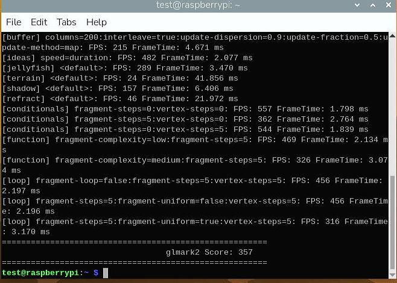

# 20260730
### 1. Write rpi image
One line command:      

```
xz -d -c 2026-06-18-raspios-trixie-arm64-full.img.xz | sudo dd of=/dev/sdb bs=4M status=progress conv=fsync
```
Start ssh:     

```
sudo systemctl enable --now ssh
```
Change repository:      

```
test@raspberrypi:~ $ cat /etc/apt/sources.list.d/raspi.sources 
Types: deb
URIs: https://mirrors.ustc.edu.cn/archive.raspberrypi.org/debian
Suites: trixie
Components: main
Signed-By: /usr/share/keyrings/raspberrypi-archive-keyring.pgp
```
### 2. rpi gpu
via:     

```
test@raspberrypi:~ $ ls /dev/dri/by-path/ -l
total 0
lrwxrwxrwx 1 root root  8 Jul 30 09:59 platform-fec00000.v3d-card -> ../card0
lrwxrwxrwx 1 root root 13 Jul 30 09:59 platform-fec00000.v3d-render -> ../renderD128
lrwxrwxrwx 1 root root  8 Jul 30 09:59 platform-gpu-card -> ../card1
test@raspberrypi:~ $ cat /sys/class/drm/card0/device/uevent | grep DRIVER
DRIVER=v3d
test@raspberrypi:~ $ cat /sys/class/drm/card1/device/uevent | grep DRIVER
DRIVER=vc4-drm
```
Get the GPU infos:      

```
test@raspberrypi:~ $ vcgencmd get_mem gpu
gpu=76M
test@raspberrypi:~ $ vcgencmd measure_clock core
frequency(1)=500000992
```



ffmpeg testing:     

```
 ffmpeg -y -c:v h264_v4l2m2m -i changan.mp4 -c:v h264_v4l2m2m -b:v 4M -c:a copy output_hw_encoded.mp4
```
### 3. v4l2 tips

```
test@raspberrypi:~ $ for i in {10,11,12,18,31}
> do
> v4l2-ctl -D -d /dev/video$i | grep 'Card type'
> done
	Card type        : bcm2835-codec-decode
	Card type        : bcm2835-codec-encode
	Card type        : bcm2835-codec-isp
	Card type        : bcm2835-codec-image_fx
	Card type        : bcm2835-codec-encode_image
test@raspberrypi:~ $ v4l2-ctl --list-devices
bcm2835-codec-decode (platform:bcm2835-codec):
	/dev/video10
	/dev/video11
	/dev/video12
	/dev/video18
	/dev/video31

bcm2835-isp (platform:bcm2835-isp):
	/dev/video13
	/dev/video14
	/dev/video15
	/dev/video16
	/dev/video20
	/dev/video21
	/dev/video22
	/dev/video23
	/dev/media1
	/dev/media2

rpi-hevc-dec (platform:rpi-hevc-dec):
	/dev/video19
	/dev/media0

bcm2835-codec (vchiq:bcm2835-codec):
	/dev/media3

```
Get detailed info:      

```
test@raspberrypi:~ $ v4l2-ctl -d /dev/video10 --list-framesizes=H264
ioctl: VIDIOC_ENUM_FRAMESIZES
	Size: Stepwise 32x32 - 1920x1920 with step 2/2

通俗解释：你在问内核：“video10 这个解码工具，最少和最多能解多大尺寸的视频？”
底层数据分析：
32x32 - 1920x1920：说明这个硬件模块最低支持 32×32 像素，最高支持 1920×1920 像素。
Stepwise / step 2/2：表示图像的长宽像素增加时，必须以 2 个像素为步长（例如必须是偶数分辨率）。
结论：它根本解不了 4K 视频（3840×2160 超出了 1920×1920 的极限），1080p（1920×1080）就是它的极限天花板。

test@raspberrypi:~ $ v4l2-ctl -d /dev/video11 --list-ctrls | grep h264
          h264_minimum_qp_value 0x00990a61 (int)    : min=0 max=51 step=1 default=20 value=20 flags=has-min-max
          h264_maximum_qp_value 0x00990a62 (int)    : min=0 max=51 step=1 default=51 value=51 flags=has-min-max
            h264_i_frame_period 0x00990a66 (int)    : min=0 max=2147483647 step=1 default=60 value=60 flags=has-min-max
                     h264_level 0x00990a67 (menu)   : min=0 max=15 default=11 value=11 (4) flags=has-min-max
                   h264_profile 0x00990a6b (menu)   : min=0 max=4 default=4 value=4 (High) flags=has-min-max

通俗解释：你在问内核：“video11 这个编码工具，有哪些可以调节的压缩选项？”
底层数据分析：
h264_profile ... value=4 (High)：对应 H.264 压缩画质的 High Profile（高规格） 模式，保证了转码后画面质量好。
h264_level ... value=11 (4)：对应 H.264 Level 4.0 规格。
💡 小知识：国际 H.264 标准规定，Level 4.0 的处理能力上限换算成数据吞吐量，正好对应 1080p 分辨率下每秒最大 30.0 帧（1080p@30fps）。如果想达到 1080p@60fps，需要 Level 4.2，但这超出了芯片硬编码的时钟能力。
qp_value：画质量化参数（QP），数字越小画质越好、文件越大。
i_frame_period ... value=60：表示默认每 60 帧插入一个完整关键帧（GOP/I帧）。

test@raspberrypi:~ $ v4l2-ctl -d /dev/video19 --list-formats-ext
ioctl: VIDIOC_ENUM_FMT
	Type: Video Capture Multiplanar

	[0]: 'Nc12' (Y/CbCr 4:2:0 (128b cols))
	[1]: 'Nc30' (10-bit Y/CbCr 4:2:0 (128b cols))
	[2]: 'NC12' (Y/CbCr 4:2:0 (128b cols))
	[3]: 'NC30' (10-bit Y/CbCr 4:2:0 (128b cols))

通俗解释：你在问内核：“video19 这个专门播放 HEVC（H.265）的硬件，解完码后能输出什么样的原始图像数据给显卡显示？”

底层数据分析：
Nc12 (8-bit YUV 4:2:0)：标准的 8 位色彩格式（绝大多数普通 H.265 电影用的格式）。
Nc30 (10-bit YUV 4:2:0)：高规格的 10-bit 色彩格式！
结论：
常见的 HDR 10-bit 4K 电影（色彩更丰富、暗部细节更好），老牌 H.264 芯片根本无法处理；
而树莓派 4 的 /dev/video19 （rpi-hevc-dec / rpivid）内置了专属硬件，能够解析 10-bit H.265 4K 视频。

这三条命令正好印证了之前对树莓派硬件能力的判断：
video10：尺寸最大支持到 1920x1920（H.264 1080p 解码极限）。
video11：策略等级固定在 Level 4.0（H.264 1080p30fps 编码极限）。
video19：支持 Nc30 (10-bit)，专为 4K H.265 / HDR 超清电影 打造。
```
Reason for 2 lines ofr `Nc30/NC30`:     

```
在 Linux 中，每一个像素格式都有一个 4 字节的代号，叫 FourCC（四个字符代码）。
这两行看似一样，但字符的 ASCII 码不同：
Nc30（小写 c）：在内核中代表 非压缩（Uncompressed / Tiled） 存储模式。
NC30（大写 C）：在内核中代表 硬件压缩（Compressed / Broadcom Sand Column Formats） 存储模式。

为什么要搞两行？
因为树莓派 4 的 4K HEVC 解码硬件（rpivid）非常特殊：
解码完数据放在显存里（NC30，大写）：画面数据是以树莓派芯片专属的“列压缩模式”存放的，这时候数据量最小、渲染最快。
需要交给其它普通软件（Nc30，小写）：如果要把画面转给其它不支持 Broadcom 专属压缩格式的软件，就需要转化为非压缩的标准瓦片格式。
这两行代表同一个色彩格式在树莓派硬件内部的两种“数据排列/压缩状态”，供上层播放器（如 Kodi、VLC）根据渲染需求自由选择。
```
### 4. 
Following command will failed when on aarch64, cause virt-builder doesn't have aarch64 debian image:    

```
Guest System Image
Create the Debian image:

cd ..  # Back to the workspace root
virt-builder debian-12 \
  --install v4l-utils \
  --install ffmpeg \
  --root-password password:""
This command does the following:

Download a Debian 12 image,
Install the v4l-utils and ffmpeg packages into it,
Set the root password to be empty,
```
Solved via:    

```
sudo apt install -y virt-manager libguestfs-tools
sudo systemctl enable libvirtd --now
sudo virsh net-autostart default
sudo virsh net-start default
sudo reboot
wget https://mirrors.ustc.edu.cn/debian-cdimage/cloud/bookworm/latest/debian-12-genericcloud-arm64.qcow2
test@raspberrypi:~ $ mv debian-12-genericcloud-arm64.qcow2 debian-12-arm64.qcow2

virt-customize -a debian-12-arm64.qcow2 \
  --run-command 'sed -i "s|http://deb.debian.org|https://mirrors.ustc.edu.cn|g" /etc/apt/sources.list /etc/apt/sources.list.d/* 2>/dev/null || true' \
  --run-command 'apt-get update' \
  --install v4l-utils,ffmpeg \
  --root-password password:"123456"
```
