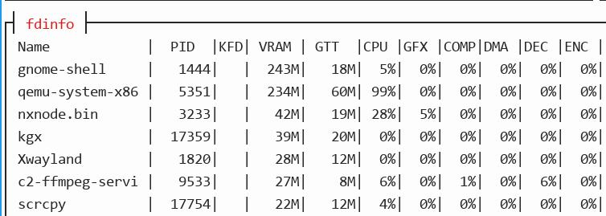

# 20260811
### 1. waydroidATV(redroid) verification
Run with:      

```
❯ sudo docker run --privileged --name soft -v /home/test/softdata:/data -p 5667:5555 -itd ownwaydroid232jul21   ro.waydroid.software_rendering=1
```
redroid info:     

```
1f6136775795:/ # dumpsys SurfaceFlinger | grep GLES                                                                                                                                          
 ------------RE GLES (Ganesh)------------
GLES: Google Inc. (Google), ANGLE (Google, Vulkan 1.3.0 (SwiftShader Device (LLVM 16.0.0) (0x0000C0DE)), SwiftShader driver-5.0.0), OpenGL ES 3.1.0 (ANGLE 2.1 git hash: ab6a82e0ed1425316da0ba9a0b1c715a58a0b725)
1f6136775795:/ # dumpsys media.player | grep -i hw-acc                                                                                                                                       
      hw-accelerated: 0 ]
      hw-accelerated: 1 ]
      hw-accelerated: 1 ]
      hw-accelerated: 0 ]
      hw-accelerated: 1 ]
130|1f6136775795:/ # getprop | grep hwcompose                                                                                                                                                
[init.svc.vendor.hwcomposer-2-1]: [running]
[init.svc_debug_pid.vendor.hwcomposer-2-1]: [221]
[ro.boottime.vendor.hwcomposer-2-1]: [1380590084923]
[ro.hardware.hwcomposer]: [redroid]
1f6136775795:/ # getprop | grep ffmpeg                                                                                                                                                       
[debug.ffmpeg-codec2.hwaccel.drm]: [0]
[debug.ffmpeg-codec2.pixel_format]: [RGBX_8888]
[debug.ffmpeg-codec2.rank]: [0]
[ro.waydroid.codec2-impl]: [c2.ffmpeg]
```



Even soft rendering got the c2-ffmpeg-service's video decoding acceleration.    

### 2. mpv decoding
vulkan:    

```
 mpv --vo=gpu-next --gpu-api=vulkan --hwdec=vulkan rain.mp4
● Video  --vid=1  (h264 640x480 29.97 fps) [default]
● Audio  --aid=1  (aac 2ch 44100 Hz 128 kbps) [default]
File tags:
 Artist: 齊秦經典 Classic Chyi Chin
 Title: 齊秦 - 無情的雨無情的你 (MTV版)
[ffmpeg/video] h264: Device does not support the VK_KHR_video_decode_queue extension!
[ffmpeg/video] h264: no frame!
[ffmpeg/video] h264: Device does not support the VK_KHR_video_decode_queue extension!
[ffmpeg/video] h264: no frame!
AO: [pipewire] 44100Hz stereo 2ch floatp
VO: [gpu-next] 640x480 yuv420p
AV: 00:00:09 / 00:04:04 (4%) A-V:  0.000
Exiting... (Quit)

ANV_DEBUG=video-decode mpv --vo=gpu-next --hwdec=vulkan rain.mp4
● Video  --vid=1  (h264 640x480 29.97 fps) [default]
● Audio  --aid=1  (aac 2ch 44100 Hz 128 kbps) [default]
File tags:
 Artist: 齊秦經典 Classic Chyi Chin
 Title: 齊秦 - 無情的雨無情的你 (MTV版)
[ffmpeg/video] h264: Device does not support the VK_KHR_video_decode_queue extension!
[ffmpeg/video] h264: no frame!
[ffmpeg/video] h264: Device does not support the VK_KHR_video_decode_queue extension!
[ffmpeg/video] h264: no frame!
AO: [pipewire] 44100Hz stereo 2ch floatp
VO: [gpu-next] 640x480 yuv420p
AV: 00:00:12 / 00:04:04 (5%) A-V:  0.000

RADV_PERFTEST=video_decode mpv --vo=gpu-next --hwdec=vulkan rain.mp4
● Video  --vid=1  (h264 640x480 29.97 fps) [default]
● Audio  --aid=1  (aac 2ch 44100 Hz 128 kbps) [default]
File tags:
 Artist: 齊秦經典 Classic Chyi Chin
 Title: 齊秦 - 無情的雨無情的你 (MTV版)
radv: RADV_PERFTEST=video_decode is deprecated and will be removed in future Mesa releases. Please use RADV_EXPERIMENTAL=video_decode instead.
Using hardware decoding (vulkan).
AO: [pipewire] 44100Hz stereo 2ch floatp
VO: [gpu-next] 640x480 vulkan[nv12]
AV: 00:00:09 / 00:04:04 (4%) A-V:  0.000
```
vaapi:     

```
mpv --vo=gpu-next --hwdec=vaapi rain.mp4
● Video  --vid=1  (h264 640x480 29.97 fps) [default]
● Audio  --aid=1  (aac 2ch 44100 Hz 128 kbps) [default]
File tags:
 Artist: 齊秦經典 Classic Chyi Chin
 Title: 齊秦 - 無情的雨無情的你 (MTV版)
AO: [pipewire] 44100Hz stereo 2ch floatp
VO: [gpu-next] 640x480 yuv420p
AV: 00:00:13 / 00:04:04 (5%) A-V:  0.000
Exiting... (Quit)


mpv --vo=gpu --hwdec=vaapi rain.mp4
● Video  --vid=1  (h264 640x480 29.97 fps) [default]
● Audio  --aid=1  (aac 2ch 44100 Hz 128 kbps) [default]
File tags:
 Artist: 齊秦經典 Classic Chyi Chin
 Title: 齊秦 - 無情的雨無情的你 (MTV版)
AO: [pipewire] 44100Hz stereo 2ch floatp
VO: [gpu] 640x480 yuv420p
AV: 00:00:07 / 00:04:04 (3%) A-V:  0.000
Exiting... (Quit)


  LIBVA_DRIVER_NAME=radeonsi mpv --vo=gpu --hwdec=vaapi rain.mp4
● Video  --vid=1  (h264 640x480 29.97 fps) [default]
● Audio  --aid=1  (aac 2ch 44100 Hz 128 kbps) [default]
File tags:
 Artist: 齊秦經典 Classic Chyi Chin
 Title: 齊秦 - 無情的雨無情的你 (MTV版)
AO: [pipewire] 44100Hz stereo 2ch floatp
VO: [gpu] 640x480 yuv420p
AV: 00:00:09 / 00:04:04 (4%) A-V:  0.000
Exiting... (Quit)

  mpv --hwdec=auto rain.mp4
● Video  --vid=1  (h264 640x480 29.97 fps) [default]
● Audio  --aid=1  (aac 2ch 44100 Hz 128 kbps) [default]
File tags:
 Artist: 齊秦經典 Classic Chyi Chin
 Title: 齊秦 - 無情的雨無情的你 (MTV版)
[ffmpeg/video] h264: Device does not support the VK_KHR_video_decode_queue extension!
[ffmpeg/video] h264: no frame!
[ffmpeg/video] h264: Device does not support the VK_KHR_video_decode_queue extension!
[ffmpeg/video] h264: no frame!
Cannot load libcuda.so.1
[ffmpeg/video] h264: Device does not support the VK_KHR_video_decode_queue extension!
[ffmpeg/video] h264: Failed setup for format vulkan: hwaccel initialisation returned error.
[ffmpeg/video] h264: no frame!
[ffmpeg/video] h264: Device does not support the VK_KHR_video_decode_queue extension!
[ffmpeg/video] h264: Failed setup for format vulkan: hwaccel initialisation returned error.
[ffmpeg/video] h264: no frame!
[ffmpeg] CUDA: Cannot load libcuda.so.1
[ffmpeg] CUDA: Could not dynamically load CUDA
Using hardware decoding (vaapi-copy).
AO: [pipewire] 44100Hz stereo 2ch floatp
VO: [gpu-next] 640x480 nv12
AV: 00:00:07 / 00:04:04 (3%) A-V:  0.000
Exiting... (Quit)


mpv --hwdec=vaapi rain.mp4
● Video  --vid=1  (h264 640x480 29.97 fps) [default]
● Audio  --aid=1  (aac 2ch 44100 Hz 128 kbps) [default]
File tags:
 Artist: 齊秦經典 Classic Chyi Chin
 Title: 齊秦 - 無情的雨無情的你 (MTV版)
AO: [pipewire] 44100Hz stereo 2ch floatp
VO: [gpu-next] 640x480 yuv420p
AV: 00:00:09 / 00:04:04 (4%) A-V:  0.000
Exiting... (Quit)

 LIBVA_DRIVER_NAME=radeonsi mpv --vo=gpu --gpu-context=x11egl --hwdec=vaapi rain.mp4
● Video  --vid=1  (h264 640x480 29.97 fps) [default]
● Audio  --aid=1  (aac 2ch 44100 Hz 128 kbps) [default]
File tags:
 Artist: 齊秦經典 Classic Chyi Chin
 Title: 齊秦 - 無情的雨無情的你 (MTV版)
Using hardware decoding (vaapi).
AO: [pipewire] 44100Hz stereo 2ch floatp
VO: [gpu] 640x480 vaapi[nv12]

 LIBVA_DRIVER_NAME=radeonsi mpv --hwdec=vaapi-copy rain.mp4
● Video  --vid=1  (h264 640x480 29.97 fps) [default]
● Audio  --aid=1  (aac 2ch 44100 Hz 128 kbps) [default]
File tags:
 Artist: 齊秦經典 Classic Chyi Chin
 Title: 齊秦 - 無情的雨無情的你 (MTV版)
Using hardware decoding (vaapi-copy).
AO: [pipewire] 44100Hz stereo 2ch floatp
VO: [gpu-next] 640x480 nv12
AV: 00:00:09 / 00:04:04 (4%) A-V:  0.000

LIBVA_DRIVER_NAME=radeonsi mpv --vo=gpu --hwdec=vaapi rain.mp4
● Video  --vid=1  (h264 640x480 29.97 fps) [default]
● Audio  --aid=1  (aac 2ch 44100 Hz 128 kbps) [default]
File tags:
 Artist: 齊秦經典 Classic Chyi Chin
 Title: 齊秦 - 無情的雨無情的你 (MTV版)
AO: [pipewire] 44100Hz stereo 2ch floatp
VO: [gpu] 640x480 yuv420p
AV: 00:00:11 / 00:04:04 (5%) A-V:  0.000

 LIBVA_DRIVER_NAME=radeonsi mpv --vo=gpu --gpu-context=x11egl --hwdec=vaapi-copy rain.mp4
● Video  --vid=1  (h264 640x480 29.97 fps) [default]
● Audio  --aid=1  (aac 2ch 44100 Hz 128 kbps) [default]
File tags:
 Artist: 齊秦經典 Classic Chyi Chin
 Title: 齊秦 - 無情的雨無情的你 (MTV版)
Using hardware decoding (vaapi-copy).
AO: [pipewire] 44100Hz stereo 2ch floatp
VO: [gpu] 640x480 nv12
AV: 00:00:11 / 00:04:04 (5%) A-V:  0.000

 LIBVA_DRIVER_NAME=radeonsi mpv --vo=gpu --gpu-context=x11egl --hwdec=auto rain.mp4
● Video  --vid=1  (h264 640x480 29.97 fps) [default]
● Audio  --aid=1  (aac 2ch 44100 Hz 128 kbps) [default]
File tags:
 Artist: 齊秦經典 Classic Chyi Chin
 Title: 齊秦 - 無情的雨無情的你 (MTV版)
Cannot load libcuda.so.1
Using hardware decoding (vaapi).
AO: [pipewire] 44100Hz stereo 2ch floatp
VO: [gpu] 640x480 vaapi[nv12]

 RADV_PERFTEST=video_decode mpv --vo=gpu-next --hwdec=auto rain.mp4
● Video  --vid=1  (h264 640x480 29.97 fps) [default]
● Audio  --aid=1  (aac 2ch 44100 Hz 128 kbps) [default]
File tags:
 Artist: 齊秦經典 Classic Chyi Chin
 Title: 齊秦 - 無情的雨無情的你 (MTV版)
radv: RADV_PERFTEST=video_decode is deprecated and will be removed in future Mesa releases. Please use RADV_EXPERIMENTAL=video_decode instead.
Using hardware decoding (vulkan).
AO: [pipewire] 44100Hz stereo 2ch floatp
VO: [gpu-next] 640x480 vulkan[nv12]
AV: 00:00:04 / 00:04:04 (2%) A-V:  0.000

RADV_PERFTEST=video_decode mpv --vo=gpu-next --hwdec=vaapi rain.mp4
● Video  --vid=1  (h264 640x480 29.97 fps) [default]
● Audio  --aid=1  (aac 2ch 44100 Hz 128 kbps) [default]
File tags:
 Artist: 齊秦經典 Classic Chyi Chin
 Title: 齊秦 - 無情的雨無情的你 (MTV版)
radv: RADV_PERFTEST=video_decode is deprecated and will be removed in future Mesa releases. Please use RADV_EXPERIMENTAL=video_decode instead.
AO: [pipewire] 44100Hz stereo 2ch floatp
VO: [gpu-next] 640x480 yuv420p
AV: 00:00:12 / 00:04:04 (5%) A-V:  0.000
Exiting... (Quit)

❯ LIBVA_DRIVER_NAME=radeonsi mpv --vo=gpu --gpu-context=x11egl --hwdec=auto rain.mp4
● Video  --vid=1  (h264 640x480 29.97 fps) [default]
● Audio  --aid=1  (aac 2ch 44100 Hz 128 kbps) [default]
File tags:
 Artist: 齊秦經典 Classic Chyi Chin
 Title: 齊秦 - 無情的雨無情的你 (MTV版)
Cannot load libcuda.so.1
Using hardware decoding (vaapi).
AO: [pipewire] 44100Hz stereo 2ch floatp
VO: [gpu] 640x480 vaapi[nv12]
AV: 00:00:02 / 00:04:04 (1%) A-V:  0.000
Exiting... (Quit)

❯ LIBVA_DRIVER_NAME=radeonsi mpv --vo=gpu --gpu-context=x11egl --hwdec=vaapi-copy rain.mp4
● Video  --vid=1  (h264 640x480 29.97 fps) [default]
● Audio  --aid=1  (aac 2ch 44100 Hz 128 kbps) [default]
File tags:
 Artist: 齊秦經典 Classic Chyi Chin
 Title: 齊秦 - 無情的雨無情的你 (MTV版)
Using hardware decoding (vaapi-copy).
AO: [pipewire] 44100Hz stereo 2ch floatp
VO: [gpu] 640x480 nv12
Audio device underrun detected.
AV: 00:00:04 / 00:04:04 (2%) A-V:  0.000 Dropped: 4
^[[AExiting... (Quit)

❯ LIBVA_DRIVER_NAME=radeonsi mpv --vo=gpu --gpu-context=x11egl --hwdec=vulkan rain.mp4
● Video  --vid=1  (h264 640x480 29.97 fps) [default]
● Audio  --aid=1  (aac 2ch 44100 Hz 128 kbps) [default]
File tags:
 Artist: 齊秦經典 Classic Chyi Chin
 Title: 齊秦 - 無情的雨無情的你 (MTV版)
[vo/gpu/vulkan] This is not a libplacebo vulkan gpu api context.
AO: [pipewire] 44100Hz stereo 2ch floatp
VO: [gpu] 640x480 yuv420p
Audio device underrun detected.
AV: 00:00:10 / 00:04:04 (4%) A-V:  0.000 Dropped: 4
Exiting... (Quit)

```
