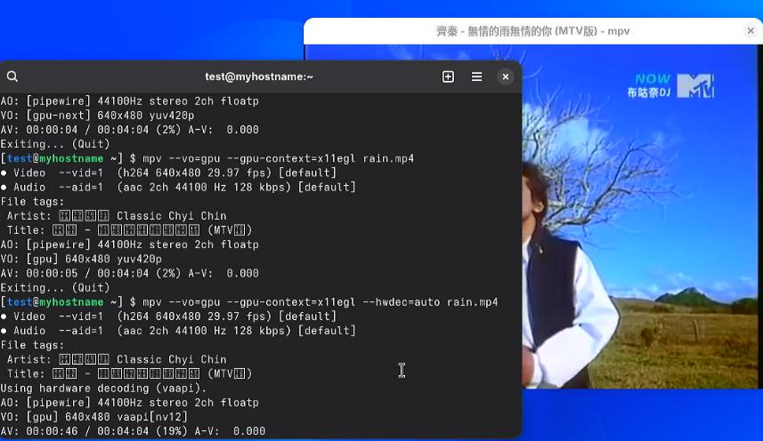
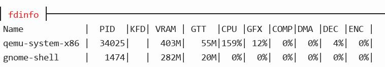
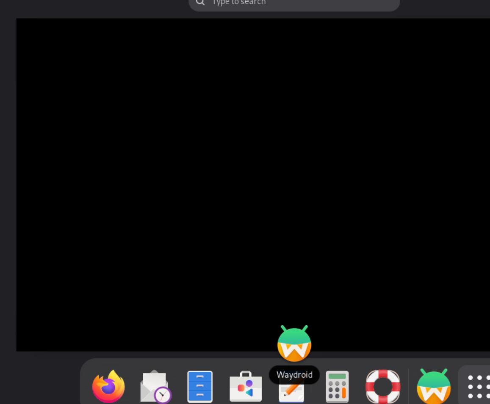
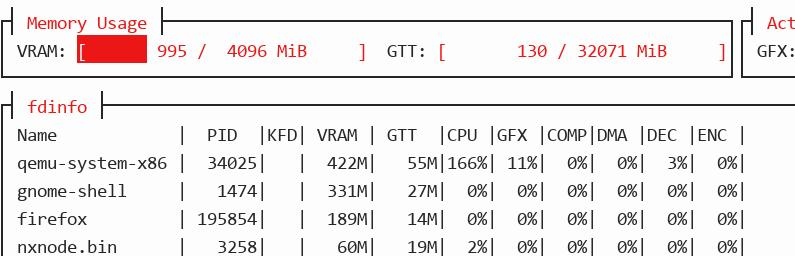
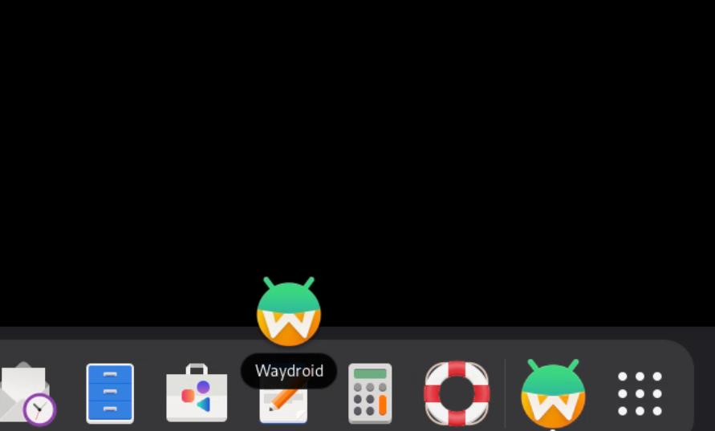
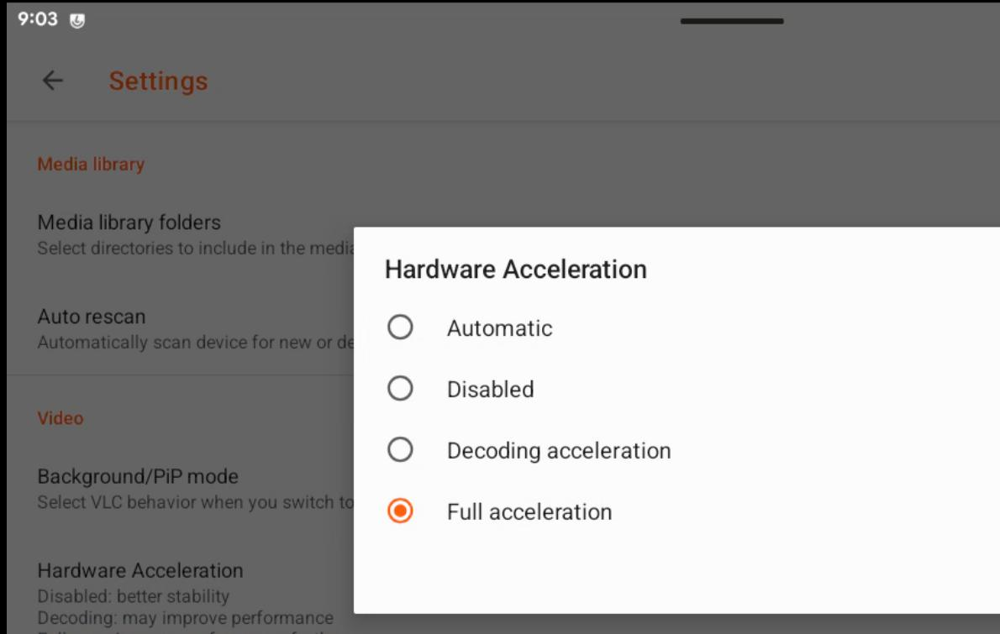
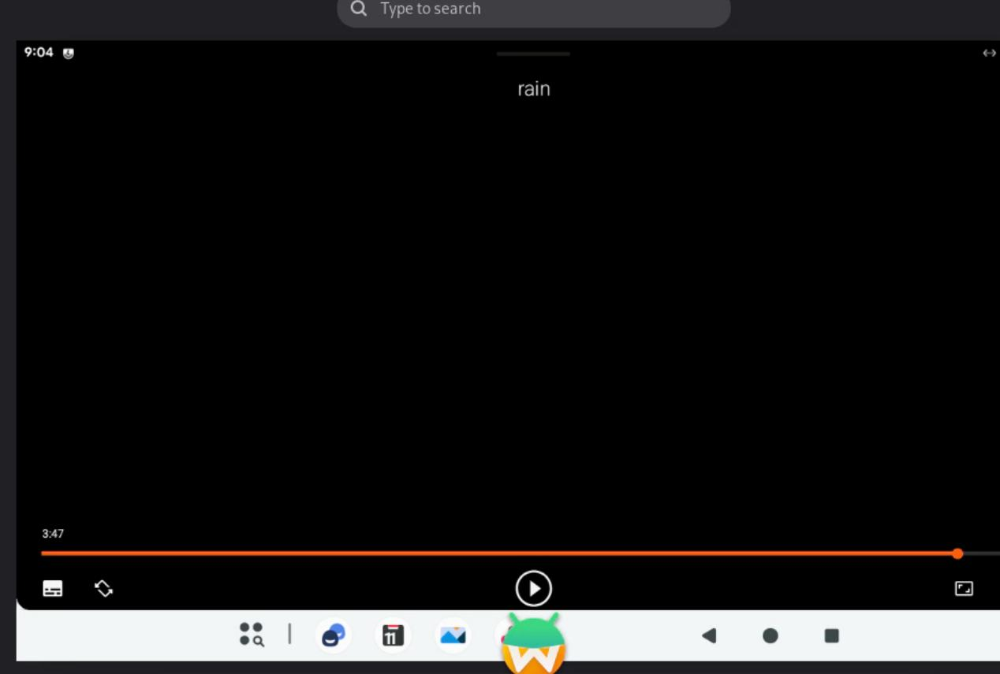

# 20260812
### 1. Archlinux aarch64
Install gnome via:      

```
sudo pacman -S gnome gdm
sudo systemctl enable gdm

```
aarch64:    



### 2. waydroid(drm native)
Using `lineage-23.2-20260302-MAINLINE-waydroid_x86_64-vendor.zip` and `lineage-23.2-20260302-VANILLA-waydroid_x86_64-system.zip`:    




black screen(waydroid):     



Using `20260717` version:    

```
$ ls 232_20260717/
lineage-23.2-20260717-MAINLINE-waydroid_x86_64-vendor.zip  lineage-23.2-20260717-VANILLA-waydroid_x86_64-system.zip  system.img  vendor.img
sudo mkdir -p /etc/waydroid-extra/images/
sudo cp <PATH TO SYSTEM IMAGE> /etc/waydroid-extra/images/system.img
sudo cp <PATH TO VENDOR IMAGE> /etc/waydroid-extra/images/vendor.img
sudo waydroid init -f
```









```
:/ # getprop | grep ffmpeg                                                                                                                                                                   
[debug.ffmpeg-codec2.hwaccel.drm]: [1]
[debug.ffmpeg-codec2.pixel_format]: [YUV_420]
[debug.ffmpeg-codec2.rank]: [0]
[ro.waydroid.codec2-impl]: [c2.ffmpeg]

```



Change:     

```
:/ # setprop debug.ffmpeg-codec2.hwaccel.drm 0                                                                                                                                               
:/ # stop media
:/ # start media
:/ # getprop | grep ffmpeg                                                                                                                                                                   
[debug.ffmpeg-codec2.hwaccel.drm]: [0]
[debug.ffmpeg-codec2.pixel_format]: [YUV_420]
[debug.ffmpeg-codec2.rank]: [0]
[ro.waydroid.codec2-impl]: [c2.ffmpeg]
```
shrinking:    


could only restored via `waydroid session stop && waydroid session start`      

```
/ # dumpsys SurfaceFlinger | grep GLES
 ------------RE GLES (Ganesh)------------
GLES: Mesa, virgl (AMD Radeon RX 550 Series (radeonsi, polaris11, ACO, ...), OpenGL ES 3.2 Mesa 26.1.5
```
### 3. waydroid(manjaro)
List installed kernel:     

```
# 查看当前运行及已安装的内核
mhwd-kernel -li

# 查看所有可安装的内核列表
mhwd-kernel -l
```
Install linux 71:     

```
    ~  sudo mhwd-kernel -i linux71                                   ✔  test@manjarovm 
```
Install kernel header files,   

```
sudo pacman -S $(mhwd-kernel -li | grep '*' | awk '{print $2}')-headers
yay binder_linux-dkms
 sudo dkms status
binder/1, 7.1.6-1-MANJARO, x86_64: installed

```
dkms will failed.     


### 4. zen kernel
Install steps:     

```
rm -f chaotic-keyring.pkg.tar.zst chaotic-mirrorlist.pkg.tar.zst

curl -L -O https://cdn-mirror.chaotic.cx/chaotic-aur/chaotic-keyring.pkg.tar.zst
curl -L -O https://cdn-mirror.chaotic.cx/chaotic-aur/chaotic-mirrorlist.pkg.tar.zst

# 1. 生成无签名配置并安装
echo -e "[options]\nSigLevel = Never" > /tmp/no-sig.conf
sudo pacman --config /tmp/no-sig.conf -U chaotic-keyring.pkg.tar.zst chaotic-mirrorlist.pkg.tar.zst

# 2. 导入信任密钥
sudo pacman-key --populate chaotic

# 3. 清理临时下载包
rm /tmp/no-sig.conf chaotic-*.pkg.tar.zst

$ vim /etc/pacman.conf

[chaotic-aur]
SigLevel = Never
Include = /etc/pacman.d/chaotic-mirrorlist

$ sudo pacman -Sy
$ sudo pacman -S linux-znver3 linux-znver3-headers
sudo update-grub
```
