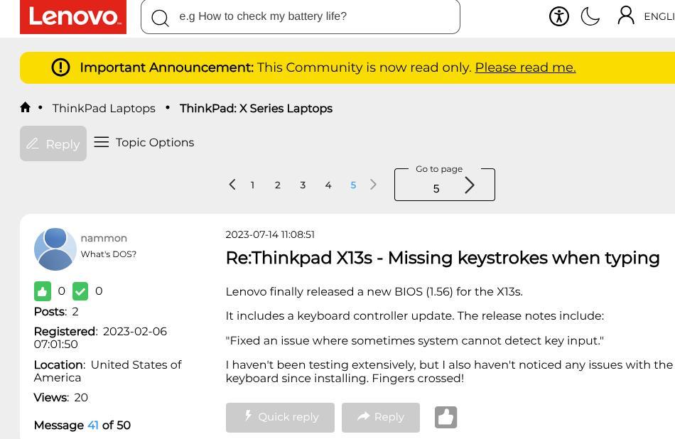
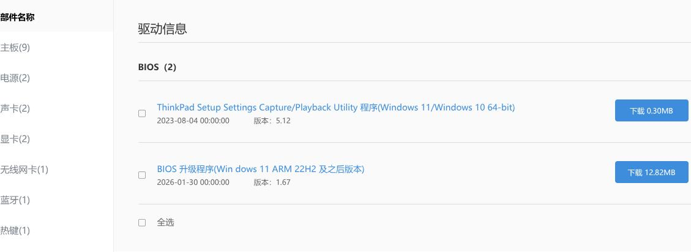

# 20260815
### 1. Recovery of x13s bootup
After upgrading bios, my x13s lost its windows bootup, it directly boots into grub>.    

Why I want to upgrade the bios? Because I met some keystroke missing, someone in forum suggest user to upgrade bios.     

`https://forums.lenovo.com/t5/ThinkPad-X-Series-Laptops/Thinkpad-X13s-Missing-keystrokes-when-typing/m-p/5190785?page=5`




So I upgrade the x13s to v1.67:   



Then I lost the windows startup item.    

Steps for recovery:      

Create a bootable usb disk(with contains  uefi shell):      

```
sudo parted /dev/sdb --script mklabel gpt
sudo parted /dev/sdb --script mkpart primary fat32 1MiB 100%
sudo parted /dev/sdb --script set 1 esp on
sudo mkfs.vfat -F 32 -n "UEFI_SHELL" /dev/sdb1
sudo pacman -S edk2-shell
sudo mount /dev/sdb1 /mnt/usb
sudo mkdir -p /mnt/usb/EFI/BOOT
sudo cp /usr/share/edk2-shell/aarch64/Shell.efi /mnt/usb/EFI/BOOT/BOOTAA64.EFI
sudo sync
sudo umount /mnt/usb
```
Then startup the x13s with this usb disk inserted, press Enter, then press F12, select the usb disk.      


```
# use -b for scrolling
map -b
bs14:
ls

bcfg boot add 0 fs14:\EFI\Microsoft\Boot\bootmgfw.efi "Windows Boot Manager"
# dump the existing items
bcfg boot dump -b
# directly boot into win11:
fs14:\EFI\Microsoft\Boot\bootmgfw.efi
```

Now you could boot into windows 10, then you could do some dual-system items.    
