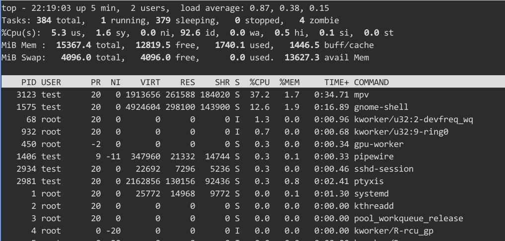
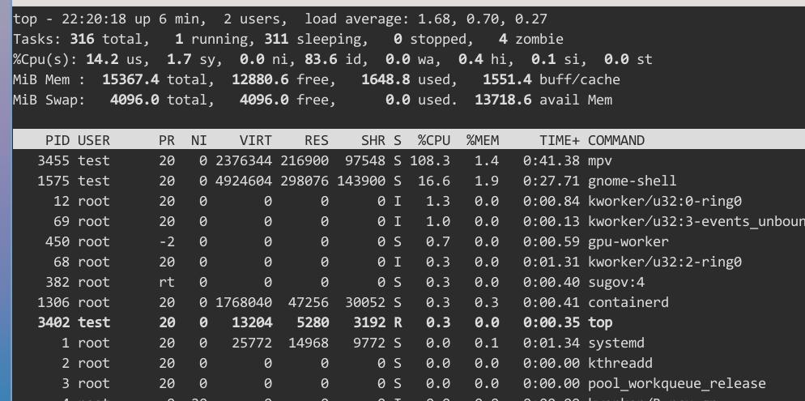

# 20260816
### 1. lenovo x13s video encoding/decoding
Detect v4l2 devices:     

```
v4l2-ctl --list-devices

Should see

Qualcomm Venus video encoder (platform:qcom-venus):
    /dev/video32
    /dev/video33

```
Examine its compliance:      

```
v4l2-compliance -d /dev/video33
```
Test the ffmpeg:      

```
ffmpeg -c:v h264_v4l2m2m -i 1080p60fps_test.mp4 -f null -

if succeed:   
[h264_v4l2m2m @ ...] Using device /dev/videoXX
driver 'qcom-venus' on card 'Qualcomm Venus video decoder'
```

Manually extract the firmware:     

```
sudo zstd -d /lib/firmware/qcom/sc8280xp/LENOVO/21BX/qcvss8280.mbn.zst -o /lib/firmware/qcom/sc8280xp/LENOVO/21BX/qcvss8280.mbn
sudo chmod 644 /lib/firmware/qcom/sc8280xp/LENOVO/21BX/qcvss8280.mbn
ls -l /lib/firmware/qcom/sc8280xp/LENOVO/21BX/qcvss8280.mbn*
sudo reboot
# TEST AGAIN
```
If the system is the ubuntu2510's 6.17.x kernel, then v4l2 will not acts OK.    

```
6.17.0-41-generic 上，X13s 的 Venus 硬件视频解码目前不可用。
虽然设备能被识别、固件也正确存在，但一使用就会触发：

qcom-venus aa00000.video-codec: wait for cpu and video core idle fail (-110)
```
### 2. jhovold WIP kernel branch
Preparation:     

```
sudo apt update
sudo apt install build-essential libncurses-dev bison flex libssl-dev libelf-dev git
sudo apt install debhelper libdw-dev
sudo apt install debhelper libdw-dev build-essential libncurses-dev bison flex \
libssl-dev libelf-dev libiberty-dev dwarves zstd pahole


git clone https://github.com/jhovold/linux.git
cd linux
git checkout wip/sc8280xp-6.16   # 或其他最新 WIP 分支

make johan_defconfig
make menuconfig

make -j$(nproc) Image modules dtbs
make -j$(nproc) bindeb-pkg LOCALVERSION=-jhovold

cd ..
apt install ./*.deb

```
Now adjust the DTB and GRUB:     

```
# 1. 找到你编译出来的 DTB
ls /usr/lib/linux-image-*/qcom/sc8280xp-lenovo-thinkpad-x13s.dtb
# 或者在源码目录：
# ls ~/Code/linux/arch/arm64/boot/dts/qcom/sc8280xp-lenovo-thinkpad-x13s.dtb

# 2. 复制 DTB 到 EFI 分区（最推荐方式）
sudo cp /usr/lib/linux-image-$(uname -r | sed 's/-generic//')*/qcom/sc8280xp-lenovo-thinkpad-x13s.dtb /boot/efi/ 2>/dev/null || \
sudo cp ~/Code/linux/arch/arm64/boot/dts/qcom/sc8280xp-lenovo-thinkpad-x13s.dtb /boot/efi/

# 3. 确认复制成功
ls -l /boot/efi/sc8280xp-lenovo-thinkpad-x13s.dtb

vim /etc/default/grub
GRUB_CMDLINE_LINUX_DEFAULT="clk_ignore_unused pd_ignore_unused arm64.nopauth"

sudo update-grub
sudo reboot
```
### 3. x13s video test
kernel version:     

```
test@x13s:~$ uname -a
Linux x13s 6.16.0-jhovold-g0546ae0beea3 #3 SMP PREEMPT Sun Aug 16 19:49:25 CST 2026 aarch64 GNU/Linux
```
Using mpv for testing:      

```
$ mpv --hwdec=v4l2m2m-copy 1080p60fps_test.mp4 
● Video  --vid=1  (h264 1920x1080 60 fps) [default]
● Audio  --aid=1  (aac 2ch 44100 Hz 129 kbps) [default]
[ffmpeg/video] h264_v4l2m2m: VIDIOC_G_FMT ioctl
[ffmpeg/video] h264_v4l2m2m: VIDIOC_G_FMT ioctl
[ffmpeg/video] h264_v4l2m2m: VIDIOC_G_FMT ioctl
[ffmpeg/video] h264_v4l2m2m: VIDIOC_G_FMT ioctl
[ffmpeg/video] h264_v4l2m2m: VIDIOC_G_FMT ioctl
[ffmpeg/video] h264_v4l2m2m: VIDIOC_G_FMT ioctl
[ffmpeg/video] h264_v4l2m2m: VIDIOC_G_FMT ioctl
[ffmpeg/video] h264_v4l2m2m: VIDIOC_G_FMT ioctl
[ffmpeg/video] h264_v4l2m2m: VIDIOC_G_FMT ioctl
[ffmpeg/video] h264_v4l2m2m: VIDIOC_G_FMT ioctl
[ffmpeg/video] h264_v4l2m2m: VIDIOC_G_FMT ioctl
Using hardware decoding (v4l2m2m-copy).
[W][22:16:00.852866] pw.conf      | [          conf.c: 1204 pw_conf_load_conf_for_context()] setting config.name to client-rt.conf is deprecated, using client.conf
AO: [pipewire] 44100Hz stereo 2ch floatp
VO: [gpu] 1920x1080 nv12
AV: 00:00:03 / 00:03:31 (2%) A-V:  0.000 Dropped: 1
Exiting... (Quit)

```
Watch hardware working:     

```
watch -n 0.5 'grep -i venus /proc/interrupts'
261:       8240          0          0          0          0          0          0          0    GICv3 206 Level     venus
261:       8855          0          0          0          0          0          0          0    GICv3 206 Level     venus

```
Hardware acceleration:   



Comparing to :      

```
$ mpv --hwdec=no 1080p60fps_test.mp4 
● Video  --vid=1  (h264 1920x1080 60 fps) [default]
● Audio  --aid=1  (aac 2ch 44100 Hz 129 kbps) [default]
[W][22:19:30.695700] pw.conf      | [          conf.c: 1204 pw_conf_load_conf_for_context()] setting config.name to client-rt.conf is deprecated, using client.conf
AO: [pipewire] 44100Hz stereo 2ch floatp
VO: [gpu] 1920x1080 yuv420p
AV: 00:00:21 / 00:03:31 (10%) A-V:  0.000 Dropped: 11

```


Using `hwdec=no`, the interrupts will not increase.    

But waydroid will not start, because we lost the binder/ashmem, etc.......

```
test@x13s:~$ cat /boot/config-6.16.0-jhovold-g0546ae0beea3 | grep -i binder
# CONFIG_ANDROID_BINDER_IPC is not set
test@x13s:~$ cat /boot/config-6.16.0-jhovold-g0546ae0beea3 | grep -i ashmem
 1 test@x13s:~$ cat /boot/config-6.16.0-jhovold-g0546ae0beea3 | grep -i android
# Android
# CONFIG_ANDROID_BINDER_IPC is not set
# end of Android
```
