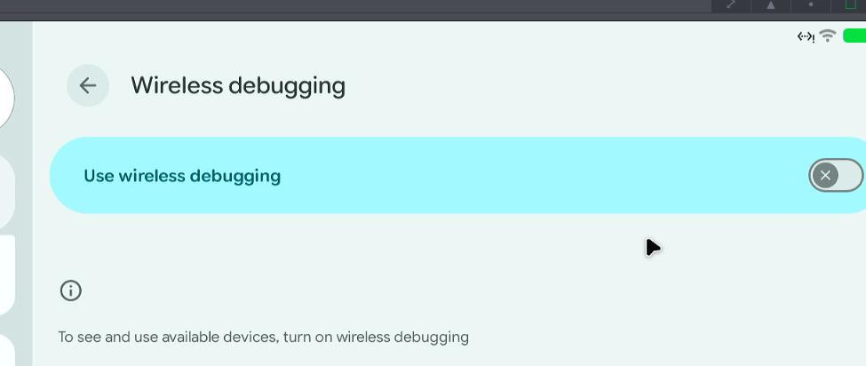
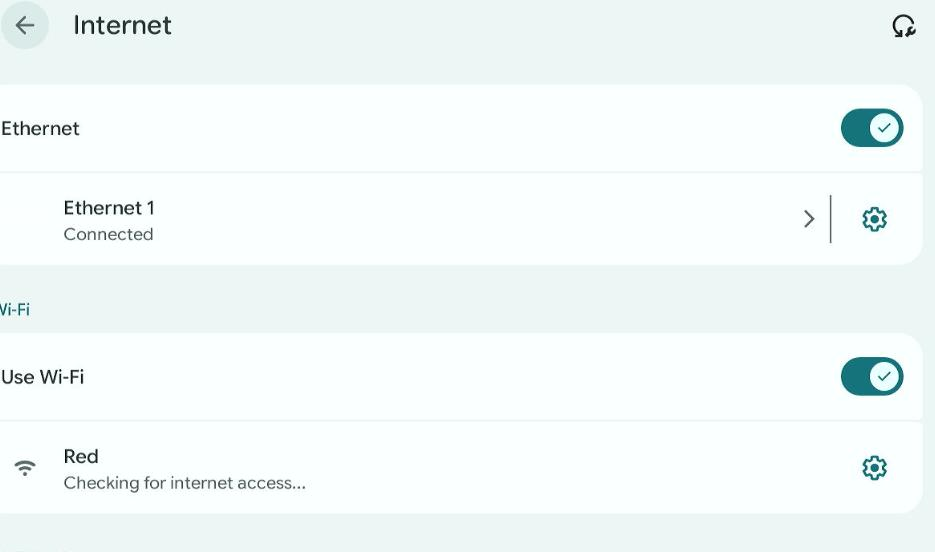
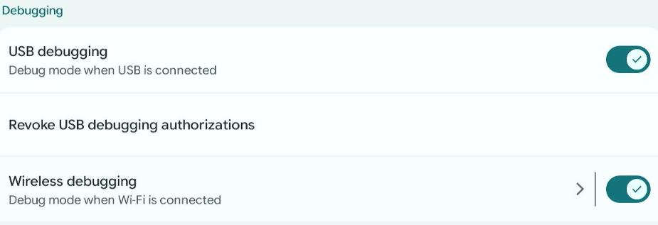
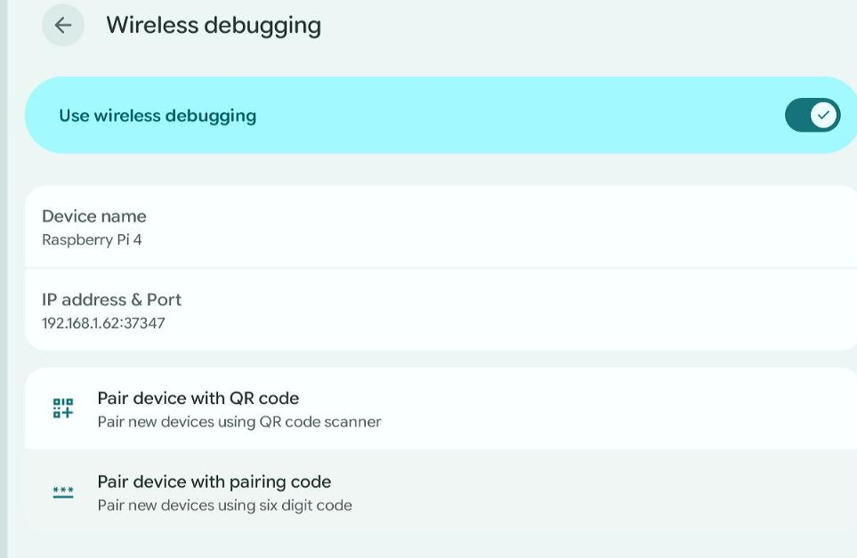
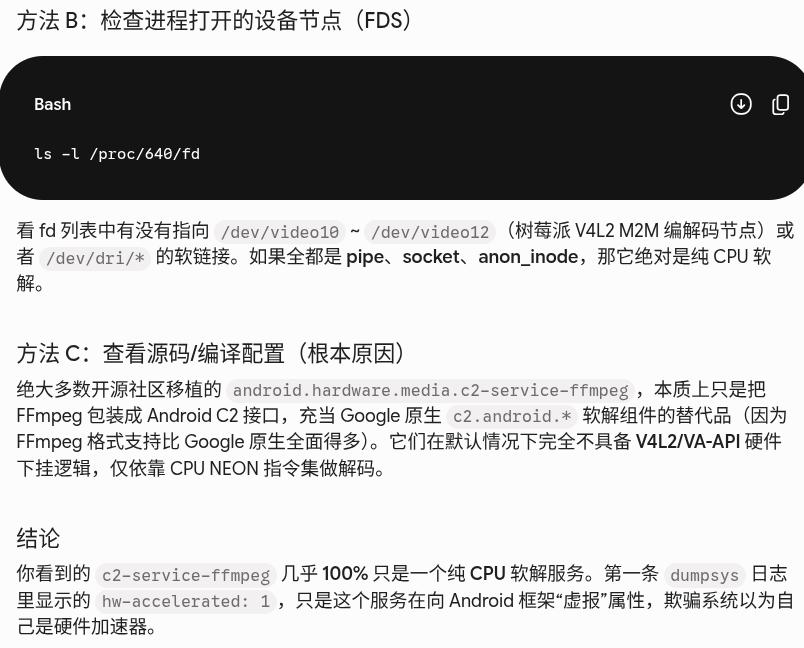

# 20260825
### 1. get the release version
Via:    

```
127|sargo:/ $ getprop ro.build.fingerprint                                                                                                                                                   
google/sargo/sargo:12/SP1A.210812.015/7679548:user/release-keys
sargo:/ $ getprop ro.product.model                                                                                                                                                           
Pixel 3a
sargo:/ $ getprop ro.board.platform                                                                                                                                                          
sdm710
sargo:/ $ uname -a
Linux localhost 4.9.270-g862f51bac900-ab7613625 #0 SMP PREEMPT Thu Aug 5 07:29:46 UTC 2021 aarch64
sargo:/ $ getprop ro.boot.bootloader                                                                                                                                                         
b4s4-0.4-7617386
sargo:/ $ getprop ro.boot.verrifiedbootstate 
```
### 2. rpi coder/decoder
Command:      

```
v4l2-ctl --list-devices
for i in 10 11 12 18 31 19; do echo "=== /dev/video$i ==="; v4l2-ctl -d /dev/video$i --list-formats-out; done
```
#### 树莓派 V4L2 硬件处理节点功能对照表

| 设备节点 | 负责处理的数据类型 | 功能说明与作用 | 常见使用场景 |
| :--- | :--- | :--- | :--- |
| **/dev/video10** | **H.264 / MJPEG** 压缩视频 | **通用硬件解码器**：专门将 H.264 格式视频或 MJPEG 动态图片流硬件解压缩为原始图像。 | 播放 1080P H.264 视频、录制/读取 USB 摄像头 MJPEG 流。 |
| **/dev/video11** | **YUV / RGB** 格式（像素数据） | **色彩与尺寸转换器**：负责在硬件层面完成图像色彩模式转换（如 YUV 转 RGB）以及画面缩放（Resize）。 | 视频播放前的格式转换、图像帧尺寸调整。 |
| **/dev/video12** | **Bayer / RAW / Grey** 原始图像数据 | **RAW 图像信号处理器**：处理相机传感器捕获的最原始、未经过色彩插值加工的数据（RAW/Bayer 格式）。 | 连接树莓派 CSI 官方摄像头模块时的底层图像处理。 |
| **/dev/video18** | **YU12 / RGB** 等特定内存格式 | **格式适配/内存对齐节点**：处理特定内存布局（如 128 位列对齐格式 `NC12`）的图像数据传输与转换。 | 系统底层硬件管线内部的数据格式适配。 |
| **/dev/video31** | **RGB / YUV** 未压缩画面 | **硬件合成/图层渲染辅助节点**：协助处理未压缩图像帧的合成与显示。 | 系统桌面 UI 绘制或视频播放器图层合成。 |
| **/dev/video19** | **S265 (HEVC / H.265)** 高清压缩数据 | **4K / H.265 硬解码专署通道**：专门为高压缩率的 H.265（HEVC）高清/超高清视频提供硬件解码加速。 | 播放 4K 高清电影、播放 H.265 格式监控视频。 |

Detect the capability:   
 
```
test@raspberrypi:~ $ v4l2-ctl -d /dev/video10 --list-framesizes=H264
ioctl: VIDIOC_ENUM_FRAMESIZES
	Size: Stepwise 32x32 - 1920x1920 with step 2/2
test@raspberrypi:~ $ v4l2-ctl -d /dev/video19 --list-framesizes=S265
ioctl: VIDIOC_ENUM_FRAMESIZES
```

#### 树莓派硬件编解码规格汇总表

| 功能模块 | 对应设备节点 | 支持的最大分辨率 | 实际算力上限（帧率） | 硬件限制说明 |
| :--- | :--- | :--- | :--- | :--- |
| **H.264 硬件解码** | `/dev/video10` | 1920 * 1920 | **1080p @ 60 fps** | 超出 1080p60 的 H.264 会引发卡顿或降级软解。 |
| **H.264 硬件编码** | `/dev/video10` | 1920 * 1920 | **1080p @ 30 fps** | 适合录制/推流，不建议压制 1080p60 高帧率视频。 |
| **H.265/HEVC 硬件解码** | `/dev/video19` | 3840 * 2160 (4K) | **4K @ 60 fps** | 仅支持解码，**不支持** H.265 硬件编码。 |
### 3. nomachien software encoding
Set software encoding:    

```
root@raspberrypi:/usr/NX/etc# cat /usr/NX/etc/node.cfg | grep -i hardwareencoding
EnableHardwareEncoding 0
root@raspberrypi:/usr/NX/etc# /usr/NX/bin/nxserver --restart
NX> 162 Disabled service: nxd.
NX> 162 Disabled service: nxserver.
NX> 162 Disabled service: nxnode.
NX> 111 New connections to NoMachine server are enabled.
NX> 161 Enabled service: nxserver.
NX> 161 Enabled service: nxnode.
NX> 161 Enabled service: nxd.

```
On raspberrypi failed.     
### 4. rpi lineageOS
Dd into the sdcard:      

```
$ sudo dd if=./lineage-23.2-20260520-UNOFFICIAL-KonstaKANG-rpi4.img of=/dev/sdb status=progress bs=10M && sudo sync
```



Connect wifi:      



Enable Wireless debugging:    



Pair device with paring code:    



```
dash@ai:~$ adb pair 192.168.1.62:37165
Enter pairing code: 677136
* daemon not running; starting now at tcp:5037
* daemon started successfully
Successfully paired to 192.168.1.62:37165 [guid=adb-10000000348569ec-FaqnlG]
```
Then connect with:       

```
dash@ai:~$ adb connect 192.168.1.62:37347
connected to 192.168.1.62:37347
dash@ai:~$ adb shell
rpi4:/ # dumpsys SurfaceFlinger | grep GLES
 ------------RE GLES (Ganesh)------------
GLES: Broadcom, V3D 4.2.14.0, OpenGL ES 3.1 Mesa 26.1.1 (git-ce4ff94462)
```
Get the media.player info:       

```
# dumpsys media.player  | grep 'hw-accelerated: 1 ' -B7                                                                                                                             
  Decoder "c2.ffmpeg.ac3.decoder" supports
    aliases: [
      "OMX.ffmpeg.ac3.decoder" ]
      hw-accelerated: 1 ]
--
  Decoder "c2.ffmpeg.alac.decoder" supports
    aliases: [
      "OMX.ffmpeg.alac.decoder" ]
      hw-accelerated: 1 ]
--
  Decoder "c2.ffmpeg.flac.decoder" supports
    aliases: [
      "OMX.ffmpeg.flac.decoder" ]
      hw-accelerated: 1 ]
--
  Decoder "c2.ffmpeg.aac.decoder" supports
    aliases: [
      "OMX.ffmpeg.aac.decoder" ]
      hw-accelerated: 1 ]
--
  Decoder "c2.ffmpeg.mp3.decoder" supports
    aliases: [
      "OMX.ffmpeg.mp3.decoder" ]
      hw-accelerated: 1 ]
--
  Decoder "c2.ffmpeg.mp2.decoder" supports
    aliases: [
      "OMX.ffmpeg.mp2.decoder" ]
      hw-accelerated: 1 ]
--
  Decoder "c2.ffmpeg.vorbis.decoder" supports
    aliases: [
      "OMX.ffmpeg.vorbisac3.decoder" ]
      hw-accelerated: 1 ]
--
  Decoder "c2.ffmpeg.h263.decoder" supports
    aliases: [
      "OMX.ffmpeg.h263.decoder" ]
      hw-accelerated: 1 ]
--
  Decoder "c2.ffmpeg.av1.decoder" supports
    aliases: [
      "OMX.ffmpeg.av1.decoder" ]
      hw-accelerated: 1 ]
--
Media type 'video/avc':
  Decoder "c2.v4l2.avc.decoder" supports
    aliases: []
      hw-accelerated: 1 ]
--
  Decoder "c2.ffmpeg.h264.decoder" supports
    aliases: [
      "OMX.ffmpeg.h264.decoder" ]
      hw-accelerated: 1 ]
--
  Decoder "c2.ffmpeg.hevc.decoder" supports
    aliases: [
      "OMX.ffmpeg.hevc.decoder" ]
      hw-accelerated: 1 ]
--
  Decoder "c2.ffmpeg.mpeg4.decoder" supports
    aliases: [
      "OMX.ffmpeg.mpeg4.decoder" ]
      hw-accelerated: 1 ]
--
  Decoder "c2.ffmpeg.mpeg2.decoder" supports
    aliases: [
      "OMX.ffmpeg.mpeg2.decoder" ]
      hw-accelerated: 1 ]
--
  Decoder "c2.ffmpeg.vp8.decoder" supports
    aliases: [
      "OMX.ffmpeg.vp8.decoder" ]
      hw-accelerated: 1 ]
--
  Decoder "c2.ffmpeg.vp9.decoder" supports
    aliases: [
      "OMX.ffmpeg.vp9.decoder" ]
      hw-accelerated: 1 ]
--
Media type 'video/avc':
  Encoder "c2.v4l2.avc.encoder" supports
      hw-accelerated: 1 ]

```
View the rank:    

```
rpi4:/ # dumpsys media.player | grep -E 'c2.v4l2|c2.ffmpeg.h264' -A2 -B2
        int32_t feature-detached-surface = 0
      }
  Decoder "c2.ffmpeg.h264.decoder" supports
    aliases: [
      "OMX.ffmpeg.h264.decoder" ]
--
      hw-accelerated: 1 ]
    owner: "codec2::ffmpeg"
    hal name: "c2.ffmpeg.h264.decoder"
    rank: 256
    profile/levels: [
--

Media type 'video/avc':
  Encoder "c2.v4l2.avc.encoder" supports
    aliases: []
    attributes: 0xb: [
--
      hw-accelerated: 1 ]
    owner: "codec2::v4l2"
    hal name: "c2.v4l2.avc.encoder"
    rank: 128
    profile/levels: [

优先级正常：128 < 256，这意味着系统的 MediaCodecList 在按条件筛选 video/avc 解码器时，c2.v4l2.avc.decoder 仍然会排在 c2.ffmpeg.h264.decoder 前面，系统默认会优先选真实的 V4L2 硬件解码器。

```
### 5. cp936 issue
Solved via:    

```
# 先清理当前目录下的乱码文件
rm -rf ./*

# 指定 GBK 或 GB18030 编码解压
unzip -O CP936 ../工具包.zip
```
### 6. ffmpeg(hw/sw) detection



Step:    

```
method A:
# 查看进程加载的 shared libraries
lsof -p 640 | grep -E 'v4l2|drm|gallium|ffmpeg|avcodec'
# 或者直接看 proc 映射
cat /proc/640/maps | grep -E 'libv4l2|libva|dri|m2m'

method B: 
ls -l /proc/640/fd

method C:
SRC looking
```
Result:       

```
1|rpi4:/ # lsof -p 640 | grep -E 'v4l2|drm|gallium|avcodec'                                                                                                                                  
binder:640_2   640      media  mem       REG              179,5     87928       2200 /system/lib64/libmediadrmmetrics_lite.so
binder:640_2   640      media  mem       REG               7,57    133736         56 /apex/com.android.hardware.media.c2.ffmpeg/lib64/libdrm.so
binder:640_2   640      media  mem       REG               7,57  15595368         42 /apex/com.android.hardware.media.c2.ffmpeg/lib64/libavcodec.so
binder:640_2   640      media  mem       REG              179,5    419248       1760 /system/lib64/android.hardware.drm@1.4.so
binder:640_2   640      media  mem       REG              179,5    201768       1754 /system/lib64/android.hardware.drm-V2-ndk.so
binder:640_2   640      media  mem       REG              179,5    320136       1757 /system/lib64/android.hardware.drm@1.1.so
binder:640_2   640      media  mem       REG              179,5    185432       1759 /system/lib64/android.hardware.drm@1.3.so
binder:640_2   640      media  mem       REG              179,5    600400       2197 /system/lib64/libmediadrm.so
binder:640_2   640      media  mem       REG              179,5     51312       1755 /system/lib64/android.hardware.drm.common-V1-ndk.so
binder:640_2   640      media  mem       REG              179,5    486296       1758 /system/lib64/android.hardware.drm@1.2.so
binder:640_2   640      media  mem       REG              179,5    469944       1756 /system/lib64/android.hardware.drm@1.0.so
```
### 7. redroid(debian)
Add binder devices:    

```
modprobe binder_linux devices=binder1,binder2,binder3,binder4,binder5,binder6
chmod 666 /dev/binder*
```
Start redroid(succeed):     

```
sudo docker  run -itd --privileged -v /dev/binder1:/dev/binder     -v /dev/binder2:/dev/hwbinder     -v /dev/binder3:/dev/vndbinder -p 5555:5555 --name redroid131 redroid/redroid:13.0.0-latest
```
start way-redroid(failed):       

```
sudo docker  run -itd --privileged -v /dev/binder4:/dev/binder     -v /dev/binder5:/dev/hwbinder     -v /dev/binder6:/dev/vndbinder -p 5555:5555 --name way1 waydroidarm64:latest ro.boot.redroid_fps=60
```
Should switch to ubuntu(24.04).    
