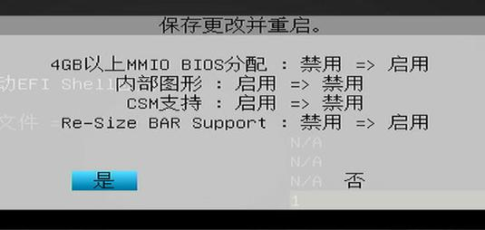

# 20260902
### 1. bios configuration for b60
b60 configuration for scl-ls:    



Also should enable csm.   
### 2. Replace multiple spaces
In vim:    

```
:%s/\s\+$//e
```
### 3. screenrecord issue
Command:     

```
636b705c046f:/ # timeout 3 screenrecord --output-format=raw-frames /data/local/tmp/raw.raw
124|636b705c046f:/ # ls -l -h /data/local/tmp/raw.raw                                                                                                                                        
-rw-r--r-- 1 root root 5.9M 2026-09-02 07:51 /data/local/tmp/raw.raw
```
