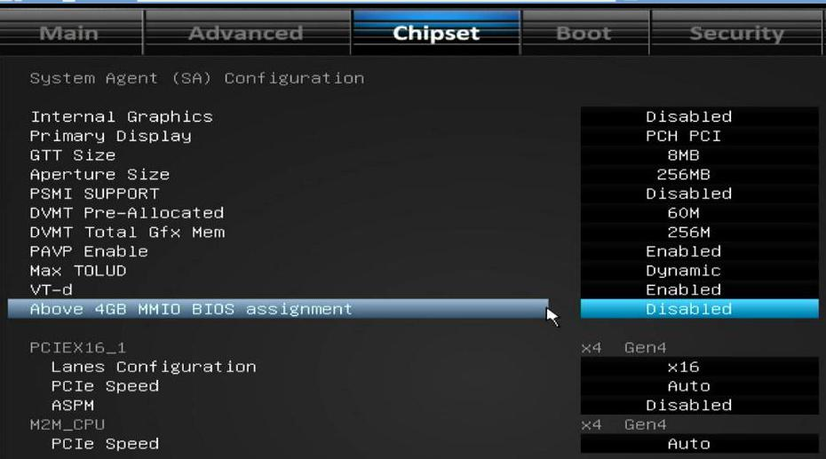
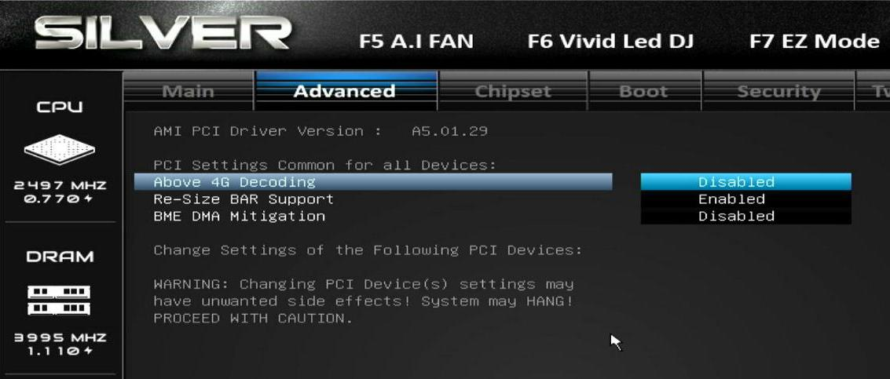
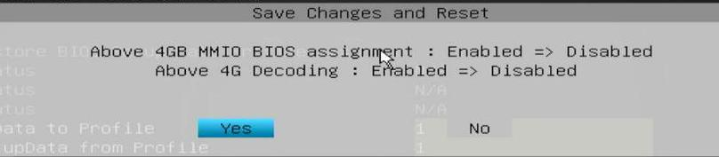
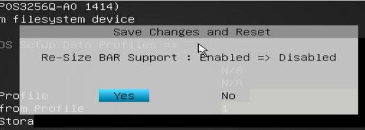

# nvidia IDV安装/调整指南
### 1. 视频说明

`rescuezilla_write_image-2025-08-19_17.28.06.mp4`关键时间点标注： 

00:00           使用写入的U盘启动机器,进入rescuezilla的启动过程。    
01:04            启动到rescuezilla图形界面下，此时插入另一块含有还原镜像文件的移动硬盘（或优盘）     
01:18 ~ 02:04   插入前后的移动硬盘情况。      
02:27           选择正确的含有还原镜像文件的移动硬盘      
03:03           导航到含有镜像文件的目录      
03:22           选择需写入的目标磁盘      
03:37           写入开始      
08:36           写入完毕，关闭rescuezilla界面      
09:03           使用gparted扩充磁盘（因原始磁盘大小为100G,需扩充到目标磁盘的512G）      
09:32           重启。重启时拔掉所有的USB盘.      
09:55 ~ 10:43   调整启动顺序（因为我们的目标机器上有多块硬盘则需要执行此操作)      
11:30           进入idv管控界面      
11:50           如果需要联网，则按照此步骤进行联网      
12:13           使用virt-manager调整虚拟机配置（需调整显卡/显卡板载声卡、usb鼠标/键盘）      
13:44           nvidia-smi查看显卡信息      
13:53           点击启动idv虚机（如果是第一次启动则可能有部分系统调整会导致有一定耗时，更新完以后启动速度会恢复正常$）      
16:59           虚机内查看显卡信息      
17:22->最后     展示IDV的关机/重启等操作。      

### 2. 操作步骤

1. 下载iso文件(`rescuezilla-2.6.1-64bit.oracular.iso`)及镜像文件(`nvidia_idv_noi915_2025-08-18-0849-img-rescuezilla.tar.xz`)    
2. Linux下使用dd命令，或者windows下使用rufus软件(`https://rufus.ie/zh/`)将`rescuezilla-2.6.1-64bit.oracular.iso`写入到usb优盘（优盘需至少2G大小).    

```
sudo dd if=./rescuezilla-2.6.1-64bit.oracular.iso of=/dev/你的优盘设备名 bs=1M && sudo sync
```
3. 将`nvidia_idv_noi915_2025-08-18-0849-img-rescuezilla.tar.xz`文件解压到某移动硬盘的目录下，注意解压前进行md5校验(md5值为`e1f978279381be9ffc5d2687e3783fc9`)     
4. 按`rescuezilla_write_image-2025-08-19_17.28.06.mp4`视频, 使用优盘启动物理机器并执行rescuezilla镜像还原.     
5. 还原成功后，拔掉U盘和移动硬盘，进入系统，按视频调整虚拟化配置并启动IDV虚机。镜像中已包含一个win10虚机。     

### 3. 操作说明

1. 镜像已在映泰z790+(RTX3050/RTX6000/RTXA6000）下验证，镜像已在同方工作站(Z690+RTX4070-12G)下验证。   
3050:       `nvidiaidv_3050-2025-08-19_14.54.23.mp4`
RTX6000:    `nvidiaidv_6000-2025-08-19_16.23.23.mp4`
RTXA6000:   `nvidiaidv_a6000_gen12z790-2025-08-19_17.04.39.mp4`
同方+4070:       `rescuezilla_write_image-2025-08-19_17.28.06.mp4`    

2. BIOS中需开启iommu功能，vt-d功能，并关闭以下选项

z790 下为支持RTXA6000, 需关闭 `Above 4GB MMIO BIOS assignment`:    



关闭 `Above 4G Decoding` 和 `Re-Size BAR Support`:     



更改详细细节:     





