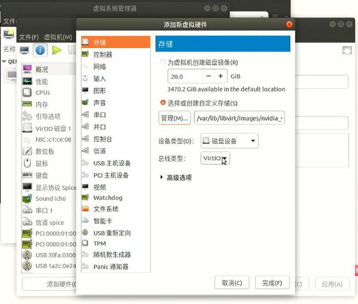
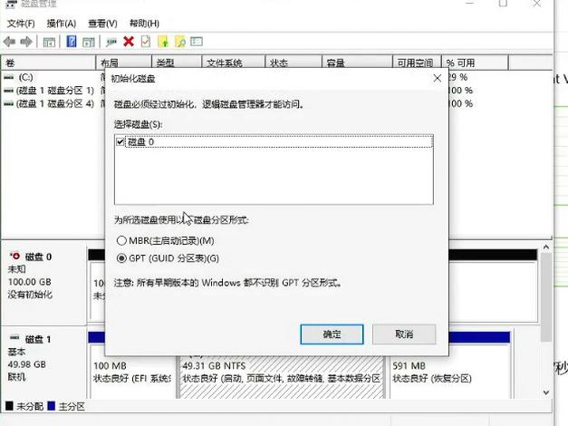
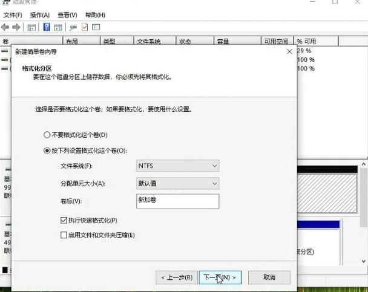
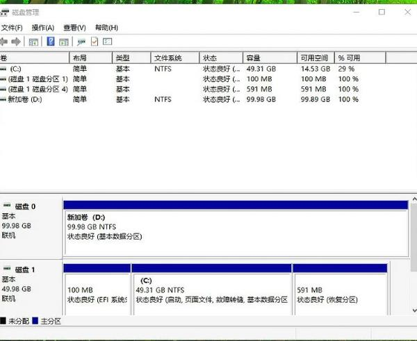
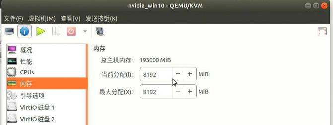
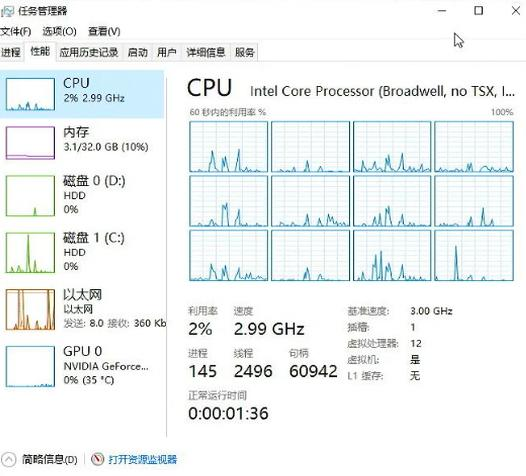
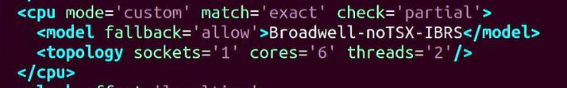
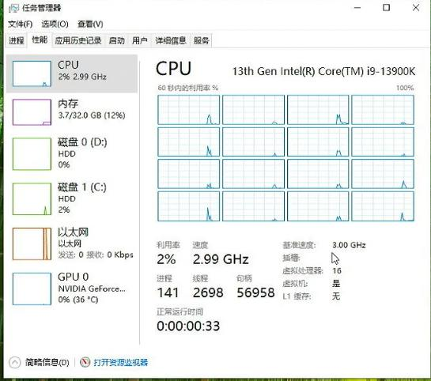
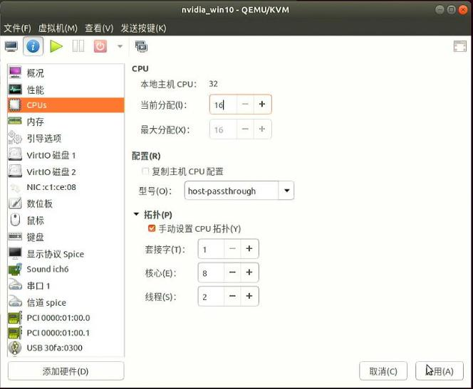

# idv性能调优
参考视频: `idv_enhancement-2025-08-20_08.20.27.mp4`:     

### 1. 虚机添加数据盘
host机器上创建100G大小的数据盘并添加到虚拟机:      

```
su root
# qemu-img create -f qcow2 nvidia_win10_d.qcow2 100G
```
打开virt-manager, 在图形化界面中，选择创建好的虚拟磁盘文件并添加到虚拟机中:     



开机进入到虚拟机后，在windows下通过磁盘管理添加D盘:     





添加完毕后：    



### 2. 调整虚拟机内存
virt-manager图形化界面中直接更改内存大小, 一般情况下，建议预留2G为host系统及组件使用：     



### 3. 调整CPU参数
默认的配置为了保证兼容性，虚机内显示的CPU型号与主机不吻合，如下：    



关机后，编辑虚机编排文件，可更改为主机型号等同的虚机内CPU配置:       

```
virsh edit nvidia_win10
```



改为：    

```
  <cpu mode='host-passthrough' check='none'>
  </cpu>
```
保存配置，启动虚拟机，更改后虚机内的CPU型号信息如下：    



### 4. 调整CPU核心数
virt-manager下调整：     



注意： Windows下，套接字只能为1, 否则可能会出错。
